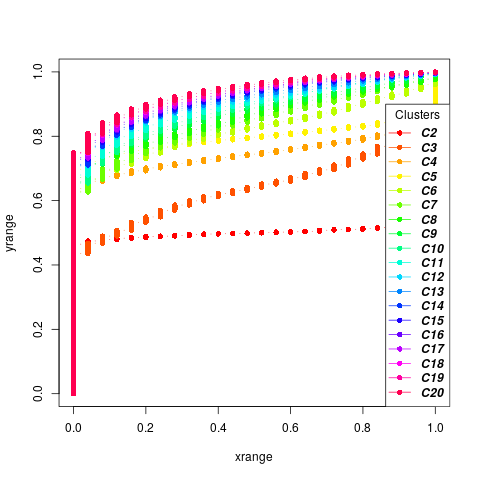
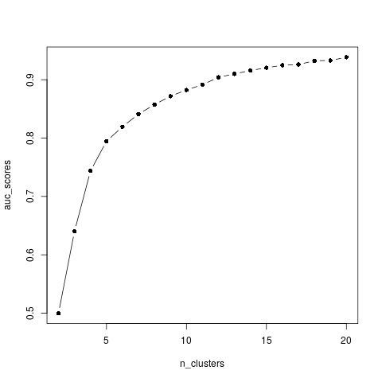

```{r echo=FALSE, results="hide", message=FALSE}
# Loading dependencies
library(devtools)
library(limma)
library(splines)
library(stats)
library(moanin)
library(NMF)
source("utils.R")
# library(moanin)
```

```{r echo=FALSE, results="hide"}
# Set options
df = 6

# Preprocessing & filtering
is_count = FALSE
take_log = FALSE    
filter_expression = FALSE

###############################################################################
# Clustering

# Whether to filter genes
filter_genes = TRUE
keep_all_significant = FALSE
n_genes_to_keep = 10000
n_clusters = 20
percentage_genes_to_label = 0.5
```

```{r echo=FALSE, results="hide"}
# Set data files and options
data("shoemaker2015")

data = shoemaker2015$data
meta = shoemaker2015$meta
meta$Group = factor(meta$Group, levels(meta$Group)[c(3, 2, 1, 5, 4)])

data = read.table(".results/quantile_normalized.txt") 

# Right now, the package doesn't contain the normalized data
de_analysis = read.table(".results/pvalues.txt", sep="\t", check.names=FALSE)

# Extract pvalues and log_fold change
lfc_col_to_keep = colnames(de_analysis)[
    grepl("-lfc_max", colnames(de_analysis))]
lfc_max = de_analysis[, lfc_col_to_keep]

pval_col_to_keep = colnames(de_analysis)[
    grepl("-pval", colnames(de_analysis))]
pvalues = de_analysis[, pval_col_to_keep]

splines_model = moanin::create_splines_model(meta, degrees_of_freedom=6)
```

# Clustering of time-course data


The very large number of genes found differentially expressed impair any
interpretation one would attempt: with 70\% of the genome found differentially
expressed, all pathways are affected by the treatment. Hence the next step of
the workflow to cluster gene expression according to their dynamical response
to the treatment. Before clustering the genes, we first reduce the set of
genes of interest to genes that are (1) significantly found differentially
expressed; (2) "highly" differentially expressed. To do this, we first
aggregate all p-values obtained during the time-course differential expresison
step in a single p-value using Fisher's method [@fisher:statistical]. Then we
select all the genes which have a Fisher adjusted p-value below 0.05 and a log
fold change of at least two between at least one condition and one time-point.


```{r filter_genes}
# Then rank by fisher's p-value and take max the number of genes of interest
# Filter out q-values for the pvalues table
fishers_pval = moanin:::fisher_method(pvalues)
fishers_qval = stats::p.adjust(fishers_pval)

genes_to_keep = row.names(
    lfc_max[(rowSums(lfc_max > 2) > 0) & (fishers_qval < 0.05), ])
y = as.matrix(data[genes_to_keep, ])
```

After filtering, we are left with `r dim(y)[1]` genes. We can then apply a
clustering. As observed by looking at genes found differentially expressed, 
many genes share a similar gene expression pattern, but on different scale.
We thus propose the following adaptation of k-means:

- **Splines estimation**: for each gene, fit the splines function with the basis
  of your choice.
- **Rescaling splines**: for each gene, rescale the estimated splines function
  such that the values are bounded between 0 and 1.
- **K-means**: apply k-means on the rescaled fitted splines to estimate the
  centroids.
- **Assign scores and labels to all genes**: then assign a score and a label
  to all gene based on a goodness-of-fit measure on the raw data. By default,
  the `splines_kmeans_score_and_label` function only labels the best 50% of
  genes.


The first three steps

```{r clustering}
# First fit the kmeans clusters
kmeans_clusters = moanin:::splines_kmeans(
    y, splines_model, n_clusters=8,
    random_seed=42,
    n_init=20)
```

We then use the `plot_centroids` function to visualize the centroids obtained
with the splines k-means model. 

```{r fig.height=6, fig.width=6}
moanin:::plot_centroids(kmeans_clusters$centroids, splines_model,
			colors=ann_colors$Group,
			smooth=TRUE)
```

The scoring and labeling can be done via the `splines_kmeans_score_and_label`
function.

```{r}
# Then assign scores and labels to all the data, using a goodness-of-fit
# scoring function.
scores_and_labels = moanin::splines_kmeans_score_and_label(
    data, kmeans_clusters)
labels = scores_and_labels$labels
labels = unlist(labels[!is.na(labels)])
```

Before performing the next steps, let us investigate in more detail the
differences between the labels provided by the splines k-means model and the
scoring and labelinig step.

```{r echo=FALSE, fig.height=6, fig.width=6, warning=FALSE}
par(mfrow=c(2, 1))
barplot(table(kmeans_clusters$clusters), col="black", main="splines k-means
labeling")
barplot(table(labels), col="black", main="score and label")
```

The scoring and label step allows to label genes that were removed during the
filtering step, yet are good matches to the centroids found during the
clustering.

```{r echo=FALSE, fig.height=6, fig.width=6, fig.caption="Confusion matrix between the two sets of labels"}
labels = unlist(labels[!is.na(labels)])
genes_scored = names(labels)

kmeans_labels = kmeans_clusters$clusters
kmeans_labels = kmeans_labels[genes_scored]

labels = labels[names(kmeans_labels)]

both_labels = data.frame("kmeans"=kmeans_labels, "scored"=labels)
# Create another cluster.
#both_labels[is.na(both_labels)] = 21
confusion_matrix = table(both_labels)
text = as.matrix(as.character(confusion_matrix))
dim(text) = dim(confusion_matrix)
NMF::aheatmap(confusion_matrix, treeheight=0, main="Confusion matrix", 
	      border=list(cell=TRUE), txt=text, legend=FALSE, Rowv=NA,
	      Colv=NA)
labels = scores_and_labels$labels
labels = unlist(labels[!is.na(labels)])

```


```{r results="hide", echo=FALSE}
# Save the clustering for the next step
kmeans_labels = as.data.frame(labels[!is.na(labels)])
write.table(kmeans_labels,
	    ".results/clustering_labels.txt",
	    sep="\t")
```


## Looking at specific clusters in details.

Now, let us look more in detail some specific clusters. Cluster 8 seems
particularly interesting: it captures genes with strong differences between
the differant influenza treatments and the control, while the control remains
relatively flat.

Heatmaps are useful to investigate the range of expression patterns for
specific genes. Here, we are going to plot heatmaps of the normalized gene
expression patterns and the rescaled gene expression patterns side by side.

First, select the genes of interest.

```{r}
cluster_to_plot = 8
genes_to_plot =  names(labels[labels == cluster_to_plot])
```


```{r fig.width=6, fig.height=8}
layout(matrix(c(1,2),nrow=1), widths=c(1.5, 2))

data_to_plot = data[genes_to_plot, ]
submeta = meta
ord = order(
  submeta$Group,
  submeta$Timepoint,
  submeta$Replicate)
submeta$Timepoint = as.factor(submeta$Timepoint)

data_to_plot = data_to_plot[, ord]
submeta = submeta[ord, ]

res = NMF::aheatmap(
    data_to_plot,
    Colv=NA,
    color="YlGnBu",
    annCol=submeta[,
                c("Group", "Timepoint")],
    annLegend=FALSE,
    annColors=ann_colors,
    main=paste("Cluster", cluster_to_plot, "(raw)"),
    treeheight=0, legend=FALSE)

# Now use the results of the previous call to aheatmap to reorder the genes.
NMF::aheatmap(
    moanin:::rescale_values(data_to_plot)[res$rowInd,],
    Colv=NA,
    Rowv=NA,
    annCol=submeta[,
                c("Group", "Timepoint")],
    annLegend=TRUE,
    annColors=ann_colors,
    main=paste("Cluster", cluster_to_plot, "(rescaled)"),
    treeheight=0)

```

Those two heatmaps demonstrate that the clustering method successfully cluster
genes that are on different scales, and yet share the same dynamical response
to the treatments.

## How to choose the number of clusters.

A common question that arises when performing clustering is how to choose the
number of clusters. A choice for the number of clusters K depends on the goal. 
In this particular case, the end goal is not the clustering, but to facilitate
interpretation of the differential expression analysis step. As a result, the
number of clusters should not exceed the number of gene sets the user wants to
interpret. This allows to set a maximum number of clusters. Let us assume here
that this number is 20 clusters.

Once the maximum number of clusters is set, several strategies allow to
identify the number of clusters:

- **Elbow method**. First introduced in 1953 by Thorndike [@thorndike:who],
  the elbow methods looks at the total with cluster sum of squares 
  as a function of the number of clusters (WCSS). When adding clusters
  doesn't decrease the WCSS by a sufficient
  amount, one can consider stopping. This method thus provides visual aid to
  the user to choose the number of clusters, but often the "elbow" is hard to
  see on real data, where the number of clusters is not clearly defined.
- **Silhouette method**. Similarly to the Elbow method, the Silhouette method
  refers to a method of validation of consistency within clusters, and
  provides visual aid to choose the number of clusters.
- **Stability methods** Stability methods are more computationally intensive
  than any other method, as they rely on assessing the stability of the
  clustering for every $k$ to a small randomization of the data. The user is
  then invited to choose the number of cluster based on a number of similarity
  measures.

First, let us run the clustering for all possible clusters of interest. We
will, for each clustering experiment, conserve (1) with within cluster sum of
squares; (2) the labels assigned to all genes.

```{r running_clustering_on_all_k}
all_possible_n_clusters = c(5, 9, 11, 15)
all_clustering = list()
wss_values = list()

i = 1
for(n_cluster in all_possible_n_clusters){
    clustering_results = moanin:::splines_kmeans(
	y, splines_model,
	n_clusters=n_cluster, random_seed=42,
	n_init=10)
    wss_values[i] = sum(clustering_results$WCSS_per_cluster)
    all_clustering[[i]] = clustering_results$clusters
    i = i + 1
}
```

### Elbow method

The Elbow method to choose the number of clusters relies on visualization aid
to choose the number of cluster. The method relies on plotting the within
cluster sum of squares as a function of the number of clusters. At some point,
the WCSS will stop dropping, giving an angle in the graph.  The number of
cluster is chosen at this "Elbow point."


```{r elbow_method, fig.width=6, fig.height=4}
plot(all_possible_n_clusters, wss_values,
     type="b", pch=19, frame=FALSE, 
     xlab="Number of clusters K",
     ylab="Total within-clusters sum of squares")

```

### Average silhouette method

The silhouette value is a measure of how similar a data point is to its own
cluster (cohesion) compared to other clusters (separation). 

```{r average_silhouette_method, fig.width=6, fig.height=4}
# function to compute average silhouette for k clusters
average_silhouette = function(labels, y) {
    silhouette_results = cluster::silhouette(unlist(labels[1]), dist(y))
    return(mean(silhouette_results[, 3]))
}

# extract the average silhouette
average_silhouette_values = list()
i = 1
for(i in 1:length(all_clustering)){
    labels = all_clustering[i]
    average_silhouette_values[i] = average_silhouette(labels, y)
    i = i + 1
}

plot(all_possible_n_clusters, average_silhouette_values,
     type="b", pch=19, frame=FALSE,
     xlab="Number of clusters K",
     ylab="Average Silhouettes")
```

### Looking at the stability of the clustering

On real data, the number of clusters is not only unknown but also 
ambiguous: it will depend on the desired clustering resolution of the user.
Yet, in the case of biological data, stability and reproducibility of the
results is necessary to ensure that the biological interpretation of the
results hold when the data or the model is exposed to reasonable
perturbations.

Methods that rely on the stability of the clustering results to choose $k$
thus ensure that the biological interpretation of the clusters hold with
perturbtation to the data. In addition, simulation where the data is generated
with a well defined $k$ show that the clustering is more stable for the
correct of number of the clusters.

Most methods method to find the number of clusters with stability measures
only provide visual aids to guide the user. The first element often visualized
is the consensus matrix: the consensus matrix is an $n \times n$ matrix that
stores the proportion of clustering in which two items are clustered together.
A perfect consensus matrix ordered such as each elements that belong to the
same cluster are adjacent to one another which show blocks along the diagonal
close to 1.

To perform such analysis, the first step is run the clustering several times
on a resampled dataset--either using bootstrap or subsampling.

Using the bootstrapping strategy:
```{r}
n_genes = dim(y)[1]
indices = sample(1:dim(y)[1], n_genes, replace=TRUE)

bootstrapped_y = y[indices, ]
```

Using the subsampling strategy, keeping 80% of the genes:

```{r}
subsample_proportion = 1
indices = sample(1:dim(y)[1], n_genes * subsample_proportion, replace=FALSE)
subsampled_y = y[indices, ]
```

Here we plot to stability matrix of the top 1000 genes for $k=5$ and $k=20$.

```{r fig.width=6, fig.height=4}
library(NMF)
stability_5 = read.table("results/stability_5.tsv", sep="\t")
consensus_matrix_stability_5 = moanin::consensus_matrix(stability_5,
							scale=FALSE)
NMF::aheatmap(consensus_matrix_stability_5[1:1000, 1:1000], Rowv=FALSE,
	      Colv=FALSE,
	      treeheight=0)

stability_20 = read.table("results/stability_20.tsv", sep="\t")
consensus_matrix_stability_20 = moanin::consensus_matrix(stability_20,
							 scale=FALSE)
NMF::aheatmap(consensus_matrix_stability_20[1:1000, 1:1000], Rowv=FALSE,
	      Colv=FALSE,
	      treeheight=0)

```


```{r echo=FALSE, results="hide"}
n_clusters = 2:20
all_labels = list()
for(i in n_clusters){
    filename = paste0("results/stability_", i, ".tsv")
    stability = read.table(filename, sep="\t")
    all_labels[[paste0("C", i)]] = stability
}
```


#### The model explorer strategy

The model explorer algorithm [@ben-hur:stability] proposes to estimate the
number of clusters exploiting the observation that if the number of clusters
is correct, the clustering results are stable to bootstrapping.  The
distribution of similaries between bootstrapped results for each $k$ can thus
be compared for different values of $k$ and guide the user in the choice of
number of clusters.

The model explorer strategy works as follows. First, choose a similarity
measure between two partitions or clusters $S(C_1, C_2)$. Examples are the
normalized mutual information or Fowlkes-Mallows. Then perform $n$ bootstrap
experiments to estimate the cluster centroids, followed by a step of assigning
a label to all data points. Finally, compute the pairwise similarity measure
between all bootstrapped partition, and plot the cumulative density of the
obtained scores.

```{r fig.width=6, fig.height=6}
moanin::plot_model_explorer(all_labels)
```

From this plot, we can deduce that $k=5$ is more stable than $k=3$ and $k=4$,
but not as stable as $k=2$. The model explorer strategy, in addition to
visualizing the diversity of the centroids, can thus help assessing an
adequate number of clusters.

Now, replot the same model explorer, but only for the clustering experiments
$k=6$, $k=7$, $k=8$, $k=9$ and $k=10$ so that we can see more clearly the stability
measures in that range.


```{r fig.width=6, fig.height=6}
clusters = c("C6", "C7", "C8", "C9", "C10")
selected_labels = all_labels[clusters]
moanin::plot_model_explorer(selected_labels)
```

#### Consensus clustering as a way to find $k$


The  consensus clustering [@monti:consensus] relies on a similar idea but
instead of looking at the cumulative density of similarity measures of
bootstrapped clustering, the authors suggests plotting the cumulative density
of elements of the consensus matrix. 

```{r eval=FALSE}
moanin::plot_cdf_consensus(all_labels)
```

```{r echo=FALSE}
library(knitr)

```

The stability of the clustering based on the consensus matrix can then be
measured via a single number by looking at the area under the curve: the more
stable the clustering, the closer to 0 or 1 will be the entries of consensus
matrix. The consensus clustering strategy thus suggest at looking at either
the AUC as a function of the number of the clusters or the "improvement" in
the AUC as a function of the number of cluster.

```{r echo=FALSE}
library(knitr)

```

```{r echo=FALSE}
library(knitr)
knitr::include_graphics("images/clustering_delta_AUC_consensus.png")
```

The consensus clustering method suggest that the most stable is $k=2$, which
separates over-expressed genes from under-expressed genes. While it is indeed
a very stable clustering, it does not capture the range of gene expression
patterns present in the data. This shows the limitation of such method on real
data, where the number of clusters is not clearly defined.

# References
