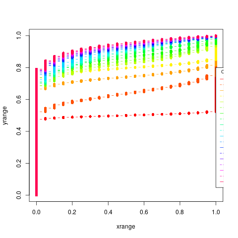
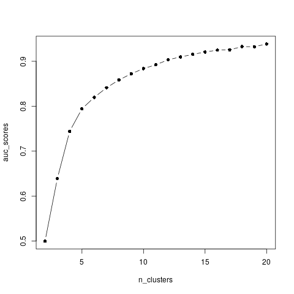
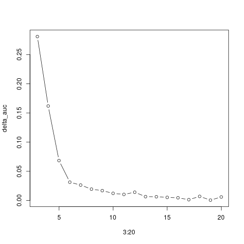

**EAP**: I don't know that describing normalization as part of our tutorial makes sense.
I've tried to change the text. 

```{r echo=FALSE, results="hide", message=FALSE}
# Loading dependencies
library(devtools)
library(limma)
library(splines)
library(stats)
library(knitr)
library(BiocStyle)
library(biomaRt)
library(kableExtra)

library(ggplot2)
library(NMF)
library(KEGGprofile)
library(viridis)

library(topGO)

```

```{r echo=FALSE, include=FALSE}
knitr::opts_chunk$set(
  cache=TRUE, autodep=TRUE, warning=FALSE, error=FALSE, message=FALSE,
  echo=TRUE, out.width=".5\\textwidth",
  duplicate.label="allow", fig.pos = "H", out.extra = "")
```


The manuscript was last compile on `r Sys.time()`.

# TODO list

- Make clear that it applies to RNASeq and how to call the different functions
    to RNASeq
- Check that clustering can deal with count data.
- Make sure package is compatible bioconductor

# Introduction

Gene expression studies provide simultaneous quantification of the level of
mRNA from all genes in a sample. High-throughput studies of gene expression
have a long history, starting with microarray technologies in the 1990s
through to single-cell technologies. While many expression studies are
designed to compare the gene expression between distinct groups, there is also a
long history of time-course expression studies. Such studies compare the 
gene expression
across time by measuring mRNA levels from samples collected at different 
timepoints [^1]. Such time-course studies can vary from measuring a few 
distinct time
points, to sampling ten to twenty time points. These longer time series are
particularly interested in investigating development over time. More recently,
a new variety of time course studies have come from single-cell sequencing experiments
[@shalek:single-cell; @habib:div-seq; @trapnell:dynamics]
which can sequence single cells at different stages of development; in this case,
the time point is the stage of the cell in the process of development -- a
value that is not know but estimated from the data as its "pseudo-time."

[^1]: Because the collection of the mRNA is often destructive, samples at
different time points are generally from different biological samples;
longitudinal studies, for example tracking the same subject over time, are
certainly possible, but not directly considered here. 

While there are many methods that have been proposed for discrete aspects of
time course data, the entire workflow for analysis of such data remains
difficult, particularly for long, developmental time series. Most methods
proposed for time course data are concerned with detecting genes that are
changing over time (differential expression analysis), examples being `edge`
[@storey:significance], functional component analysis based models [@wu:more],
time-course permutation tests [@park:statistical], and multiple testing
strategies to combine single time point differential expression analysis
[@sun:multiple]. However, with long time course data sets, particularly in
developmental systems, a massive number of genes will show *some* change. For
example, in a study of mice lung tissues infected with influenza that we
consider in this workflow, over 50% of genes
are shown to be changing over time. The task in these settings is often not to
detect changes in genes, but to categorize them into biologically interpretable
patterns. 

We present here a workflow for such an analysis that consists of 4 main
parts (Figure \ref{fig:schema}):

- Quality control and normalization;
- Identification of genes that are differentially expressed;
- Clustering of genes into distinct temporal patterns;
- Biological interpretation of the clusters.

This workflow represents an integration of both novel implementations of
previously established methods and new methodologies for the settings of
developmental time series. It relies on several standard packages for
analysing gene expression data, some specific for time-course data, others
broadly used by the community. We provide the various steps of the workflow as
functions in a R package called `moanin`.

```{r schema, echo=FALSE, fig.cap="Workflow for analyzing time-course datasets."}

knitr::include_graphics("images/fig1_schemas.png",dpi=30 )

```

## Installation and setup

 `moanin` is available from GitHub, and can be installed using the `install_github` function in the package `devtools`:

```{r eval=FALSE}
library(devtools)
install_github("NelleV/moanin")
library(moanin)
```

The following additional packages are needed for this workflow:

```{r all_libraries}
# From CRAN
library(NMF)
library(ggfortify)

# From Bioconductor
library(topGO)
library(biomaRt)
library(KEGGprofile)
library(BiocWorkflowTools)

# From GitHub
library(moanin)
```

**EAP**: Why is this list not the same as the (hidden via echo=FALSE) list at
the beginning of the document? I also needed to install `BiocWorkflowTools`,
`KEGGprofile` to run the .Rmd


# Analysis of the dynamical response of mouse lung tissue to influenza

This workflow is illustrated using data from a micro-array time-course
experiment, exposing mice to three different strains of influenza, and
collecting lung tissue during 14 time-points after infection (0, 3, 6, 9, 12,
18, 24, 30, 36, 48, 60 hours, then 3, 5, and 7 days later)
[@shoemaker:ultrasensitive]. The three strains of influenza used in the
study are (1) a low pathogenicity seasonal H1N1 influenza virus
(A/Kawasaki/UTK4/2009 [H1N1]), a mildly pathogenic virus from the 2009
pandemic season (A/California/04/2009 [H1N1]), and a highly pathogenic H5N1
avian influenza virus (A/Vietnam/1203/2004 [H5N1]. Mice were injected with
$10^5$ PFU of each virus. An adidtional 42 mice were injected with a lower dose
of the Vietnam avian influenza virus ($10^3$ PFU).

By combining gene expression time-course data with virus growth data, the
authors show that the inflammatory response of lung tissue is gated until a
threshold of the virus concentration is  exceeded in the lung. Once this
threshold is exceeded, a strong inflammatory and cytokin production occurs.
This results provides evidence that the pathology response is non-linearly
regulated by virus concentration.

While we showcase this pipeline on micro-array data, [@varoquaux:lifecycle]
leverages a similar set of steps to analyse RNA-seq data of the lifetime
transcriptomic response of the crop *S. bicolor* to drought.

## Overview of the data

First let's load the data. The package `moanin` contains the normalized
data and metadata of [@shoemaker:ultrasensitive].

```{r}
# Now load in the metadata
data(shoemaker2015)
meta = shoemaker2015$meta
data = shoemaker2015$data
```

The meta data contains information about the treatment group, the replicate,
and the timepoint for each observation:

```{r echo=FALSE}
kable(head(meta))
```

Before we dive into the exploratory analysis and quality control, let us
define color schemes for our data that we will use across the whole analysis.
We define color schemes for groups and time points as named vectors. We also
define a series of markers (or plotting symbols) to distinguish replicate
samples in scatter plots. We also reorder the factor `Group` which describes the treatments so that the treatments are order from low to high pathogeny (with Control being first). 

```{r}
group_colors = c(
    "M"="dodgerblue4",
    "K"="gold",
    "C"="orange",
    "VH"="red4",
    "VL"="red2")
time_colors = grDevices::rainbow(15)[1:14]
names(time_colors) = c(0, 3, 6, 9, 12, 18, 24, 30, 36, 48, 60, 72, 120, 168)

# Combine all color schemes into one named lists.
ann_colors = list(
    Timepoint=time_colors,
    Group=group_colors
    )

replicate_markers = c(15, 17, 19)
names(replicate_markers) = c(1, 2, 3)
ann_markers = list(
    Replicate=replicate_markers)

# Reorder the conditions such that:
#	- Control is before any influenza treatment
#	- Each treatment is ordered from low to high pathogeny
meta$Group = factor(meta$Group, levels(meta$Group)[c(3, 2, 1, 5, 4)])

```


## Quality control and normalization

The first steps of analysis of gene expression data is always to do
normalization and quality control checks of the data. However, in what follows, we do not show the steps for normalization, as these are specific to the platform (microarray); the code for the normalization can be found in as a supplemental file [@abrams:protocol; @park:evalution].  

Instead, we focus on common steps for exploratory analysis of the data, including for the purpose of quality control. These steps
are not specific to time course data, but could be applied for any gene expression
analysis. For this reason, we will not print the detailed code that is needed for this part of the analysis; interested readers can examine the `rmarkdown` code that accompanies this workflow.


### Exploratory analysis and quality control


Typically, two quality control and exploratory analysis steps are 
performed before and after normalization: (1) low dimensionality embedding of
the samples; (2) correlation plots between each samples. In both cases, we
expect a strong biological signal, while replicate samples should be strongly
clustered or correlated with one another.


Before performing any additional exploratory analysis, let us only keep highly
variable genes: for this step, we keep only the top 50% most variable genes.

```{r}
variance_cutoff = 0.5
# Filter genes by median absolute deviation (mad)
variance_per_genes = apply(data, 1, mad)
min_variance = quantile(variance_per_genes, c(variance_cutoff))
variance_filtered_data = data[variance_per_genes > min_variance,]
```

```{r geneVarHist, echo=FALSE, fig.width=6, fig.height=3, fig.cap="Distribution of variance"}
hist(variance_per_genes, breaks=100, col="black", xlab="Variance",
     ylab="# probes", main="")
abline(v=min_variance, col="#AB0000", lw=2)
```

Let us first perform the PCA analysis. Here, we perform a PCA of rank 3 of the
centered and scaled gene expression data. 

```{r pca, echo=FALSE, results="hide"}
pca_data = prcomp(t(variance_filtered_data), rank=3, center=TRUE, scale=TRUE) 
percent_var = round(100 * attr(pca_data, "percentVar"))
```

In Figure \ref{fig:pcaPlots}, we visualize the data by plotting the PC components, with samples  colored by either its
condition (top row) or its sampling time (bottom row) and each replicate a different symbol. We can see a large difference in later time points.

```{r pcaPlots, echo=FALSE, results="hide", fig.width=6, fig.height=6, fig.cap="Plot of PC components: PC2 vs PC1 (right) and PC2 vs PC3 (left). Samples are colored by condition (top row) and sampling time (bottom row)."}
par(mfrow=c(2, 2))
par(mar=c(4.5, 4.5, 1.5, 1.5))
plot(
    pca_data$x[, c("PC1","PC2")],
    col=ann_colors$Group[meta$Group],
    pch=ann_markers$Replicate[as.factor(meta$Replicate)], bty="l")
mtext(at=275, text="Colored by Group", line=0.5, font=2, adj=0.5)
legend(x=250, y=25, legend=names(ann_colors$Group),
       fill=ann_colors$Group, bty="n", xpd=NA, yjust=0.5)
par(mar=c(4.5, 5.5, 1.5, .1))
plot(
    pca_data$x[, c("PC3","PC2")],
    col=ann_colors$Group[meta$Group],
    pch=ann_markers$Replicate[as.factor(meta$Replicate)],
    ylab="", bty="l", yaxt="n")
axis(2, labels=FALSE)
par(mar=c(4.5, 4.5, 1.5, 1.5))
plot(
    pca_data$x[, c("PC1","PC2")],
    col=ann_colors$Timepoint[as.factor(meta$Timepoint)],
    pch=ann_markers$Replicate[as.factor(meta$Replicate)], bty="l")
mtext(at=275, text="Colored by Timepoint", line=0.5, font=2, adj=0.5)
legend(x=250, y=-15, legend=names(ann_colors$Timepoint),
       fill=ann_colors$Timepoint, bty="n", xpd=NA, yjust=0.5)
par(mar=c(4.5, 5.5, 1.5, .1))
plot(
    pca_data$x[, c("PC3","PC2")],
    col=ann_colors$Timepoint[as.factor(meta$Timepoint)],
    pch=ann_markers$Replicate[as.factor(meta$Replicate)],
    ylab="", bty="l", yaxt="n")
axis(2, labels=FALSE)
```

We also plot in Figure \ref{fig:correlationPlot} the pearson correlation between each sample as a heatmap diagram (using the function `aheatmap` in `NMF`). We order the
samples by their Group (treatment) and Timepoint (the time of sampling).

```{r  correlationPlot, echo=FALSE, results="hide",fig.width=6, fig.height=6, fig.cap="Heatmap of the correlation between samples"}
# Reorder genes on condition, time, and replicate
ord = order(
  meta$Group,
  meta$Timepoint,
  meta$Replicate)

variance_filtered_data = variance_filtered_data[, ord]
data_corr = cor(variance_filtered_data, method="pearson")
data_corr_meta = meta[ord, ]
data_corr_meta$Timepoint = as.factor(data_corr_meta$Timepoint)
# use aheatmap from the NMF package for a heatmap
aheatmap(
    data_corr,
    Colv=NA, Rowv=NA,
    annCol=data_corr_meta[, c("Group", "Timepoint")],
    annRow=data_corr_meta[, c("Group", "Timepoint")],
    annLegend=TRUE, 
    annColors=ann_colors,
    main="Correlation plot")
```

We can already see interesting patterns emerging from the correlation plot.
First, the cross-correlation amongst samples taking from the control mice is
higher than the cross correlation amongst the rest of the treatments. Second,
the influenza-infected mice mildly react until time point 36. Third, the less
pathogenic the strain is, the closer the samples are to the control condition.
Fourth, the Vietnam samples at time point 120 and 168 are the one that are the
most different from control samples.

## Differential expression analysis of time-course data

### Approaches to DE analysis in time-course data

The next step in a gene expression analysis is typically to run a differential
expression analysis, generally to find genes different between different
conditions. For time-course data, there are two different approaches for
determining differentially expressed genes,

1) Per-time point analysis, where we consider each time point a different
condition and determine what genes are changing between specific time points, or
between conditions at a single time-point. 

2) Global analysis, where we consider the expression pattern globally over
time, and consider what genes have either different patterns between
conditions or a changing pattern (i.e. non-constant) over time. A common
approach first step is to fit a spline model to each gene
[@storey:significance], and then use that spline model to test for different
kinds of differential expression across time. 


The per-time point analysis is using classical differential expression
approaches, and is often the approach advocated when dealing with small
time-course datasets, where there are only a few time points [@ritchie:limma;
@robinson:edgeR; @love:moderated]. For long time-course datasets, however, a
separate test for each time-point results in creating many different tests,
for example one for every time point, the results of which are difficult to
integrate. We find in practice that the global analysis simplifies analysis
and interpretation of longer time courses data, with per-time point analysis
reserved for particularly interesting comparisons of individual time-points. 

Time course data can either be on a single condition (to identify genes
changing over time) or on multiple conditions (such as the influenza
data set we are considering), which will alter slightly the types of questions
we are interested in. 

**DE Analysis in `moanin`** Our package `moanin` provides functionality for performing both of
these types of approaches, though our focus is on the global approach, specifically by fitting spline models to the genes. 

In both
situations, we first need to set up a object (a `moanin_model` object) to
hold the meta data, as well as information for fitting the spline model
(formula, number of degrees of freedom of the splines, ...). The `moanin_model` object
will contain information used
throughout this analysis, in particular the condition and timepoints of each sample and the
the basis matrix for fitting splines models. 


We start by creating the `moanin_model` object using the `create_moanin_model`
function. We need to provide two things to the function: a `data.frame` with
the metadata, and the number of degrees of freedom of the splines to be used in the
functional modeling. The metadata `data.frame` object should contain at least
two columns: one named `Group`, containing the  treatement effect, and a
second one named `Timepoint` containing the timepoint information.

```{r echo=FALSE}
kable(head(meta))
```

We create a `moanin_model` for our data:

```{r}
moanin_model = create_moanin_model(meta, degrees_of_freedom=6)
```

The main operation of the `create_moanin_model` function, in addition to holding the necessary meta data of the samples,
is to create a basis matrix for the splines fit. This matrix gives the evaluation of all of the spline basis functions for
each sample (as such, replicate samples will have the same
values). By default, `create_moanin_model` will create the spline basis functions which will lead to a different spline fit for every group (as defined by the `Group` variable
in the `meta` data.frame). This is done by the following `R` formula syntax:

`formula = ~Group:ns(Timepoint, df=degrees_of_fredoom) + Group + 0`.

Alternatively, the user can provide a formula of their own, or simply provide the basis matrix themselves. 

We can see this information when we print the object:

```{r basis_matrix}
print(moanin_model)
```


### Weekly differential expression analysis

`moanin` provides a simple interface to perform a timepoint by timepoint
differential expression analysis. Comparison between groups is traditionally
done by defining the group comparisons (called `contrasts` in linear models)
as a linear combination of the coefficients of the model.  Comparing groups
within each timepoint can create many contrasts, and thus `moanin` provides
functionality to create these contrasts in an automatic way, and then calls
`limma` [@ritchie:limma] on the set of contrasts provided. By default,
`moanin` expects RNA-Seq gene counts, and will estimate voom weights.

Here, we show an example where we create contrasts that will be be the difference
between the control mouse ("M") and the mouse infected with the high dose of
the influenza strain A/Vietnam/1203/04 (H5N1) ("VL") for each time point (but
the function works with any form contrasts [@ritchie:limma]).

First, create the contrasts for all timepoints between the two groups of
interest:

```{r make_timepoints_contarts}
# Define contrasts	
contrasts = create_timepoints_contrasts("M", "VL", moanin_model)
```

This creates a character vector of contrasts to be tested, one for each timepoint, in the format required by `limma`:

```{r echo=FALSE}
contrasts[1:5]
```

Then `moanin` will run the differential expression analysis on all of those timepoints
jointly using the function `DE_timepoints`.

```{r weekly_differential_analysis}
weekly_de_analysis = DE_timepoints(
     data, moanin_model, contrasts,
     use_voom_weights=FALSE)
```

The output is a table of results, where each row corresponds to a gene and the
columns correspond to the p-value (`pval`), log-fold change (`lfc`) and
adjusted p-value (`qval`) of the sets of contrasts; the order of the genes in
the table is the same as the input `data`. Here we show the results for the
first timepoint (i.e. first three columns of the output) and the first ten
genes: 

```{r echo=FALSE}
kable(weekly_de_analysis[1:10, 1:3 ], "latex", digits=3, booktabs=TRUE)

```

Additional timepoints are in the additional columns of the output.

We will repeat this, comparing each of the remaining three treatments to the
control ("M") (code not printed here, as it is a replicate of the above, see
accompanying Rmarkdown document). 

```{r echo=FALSE, results="hide"}
contrasts = create_timepoints_contrasts("M", "K", moanin_model)
K_weekly_de_analysis =  DE_timepoints(
     data, moanin_model, contrasts,
     use_voom_weights=FALSE)

contrasts = create_timepoints_contrasts("M", "C", moanin_model)
C_weekly_de_analysis =  DE_timepoints(
     data, moanin_model, contrasts,
     use_voom_weights=FALSE)

contrasts = create_timepoints_contrasts("M", "VH", moanin_model)
VH_weekly_de_analysis =  DE_timepoints(
     data, moanin_model, contrasts,
     use_voom_weights=FALSE)
	 
```

In Figure \ref{fig:timeSignifPerTime}, we show the distribution of genes found differentially expressed per
week between control and each of the influenza strains. Such an analysis can demonstrate some general trends, with clearly more genes
being differentially expressed at later time points, and the Vietnam high-dose
showing perhaps an earlier onset than the low-dose.


```{r timeSignifPerTime,fig.width=6, fig.height=6, echo=FALSE, fig.cap="Number of genes found DE in each timepoint when comparing the influenza strains to control."}
timely_barplot = function(de_analysis, 
    labels=NULL, qval_threshold=0.05,
    xlab="Timepoint", ylab="Number of DE genes", main="", ylim=c(0, 20000), col="black", ...){

    qval_colnames = colnames(de_analysis)[
	grepl("qval", colnames(de_analysis))]
    if(is.null(labels)){
	labels = sapply(
	    strsplit(gsub("-qval", "", qval_colnames), "\\."), .subset2, 3)
    }
    number_de_genes_per_time = colSums(de_analysis[, qval_colnames] < 0.05)

    barplot(number_de_genes_per_time, 
            names.arg=labels, xlab=xlab,ylab=ylab,
            col=col, main=main, ylim=ylim,...)  
}

par(mfrow=c(2, 2))
time = names(time_colors)
timely_barplot(K_weekly_de_analysis, labels=time, main="Kawasaki", las=3)
timely_barplot(C_weekly_de_analysis, labels=time, main="California", las=3)
timely_barplot(weekly_de_analysis, labels=time, main="Vietnam low-dose", las=3)
timely_barplot(VH_weekly_de_analysis, labels=time, main="Vietnam high-dose", las=3)
```


However, the distribution of the number of genes found differentially
expressed by considering each time-point independently highlights the
challenges of such approach. We can see that some timepoints have many less
genes found significantly differentially expressed (e.g. timepoint 6H and 18H
of the Kawasaki strain). While there may be biological differences at those
time points for some genes, it seems unlikely that the large majority of genes
differentially expressed at timepoint 3H stop being differentially expressed
at 6H and then jump back to being differentially expressed at 9H. A more
likely explanation is that there is are some technical or biological artifact
about the samples for 6H that is creating higher variation and thus less
ability to detect significance.

```{r calculateCombos, echo=FALSE, results="hide"}
#Code for counting the number of unique combinations of time points that are DE
getTimepoint<-function(x){sapply(strsplit(gsub("_qval","",x),"\\."),.subset2,3)}
qval_colnames = colnames(K_weekly_de_analysis)[
    grepl("qval", colnames(K_weekly_de_analysis))]
signifCombos<-apply(K_weekly_de_analysis[, qval_colnames], 1, 
    function(x){paste(getTimepoint(qval_colnames[which(x<0.05)]),collapse=",")})
signifCombos<-signifCombos[signifCombos!=""]
tabCombos<-table(signifCombos)
```

Another difficulty with such an approach is making sense of the general
temporal structure for any particular gene, as different genes will have
different combinations of timepoints DE. For the comparison of the Kawasaki
strain to the control, for example, there are `r length(signifCombos)` genes
found DE in some timepoints, and there are `r length(tabCombos)` different
combinations of timepoints for which they are DE. Some of these make sense,
such as DE in timepoints 48H-168H (`r tabCombos["48,60,72,120,168"]` genes), but
many are very fragmentary. For example there are `r tabCombos["48,60,120,168"]`
genes which are DE in timepoints 48,60,120,168H, but *not* in the 72H. Many of
these genes are likely to have not made the cutoff for significance in 72H,
but don't show real differences in the overall trend between 48H-168H. In Figure \ref{fig:showMissingDEGenes} we show the plots of the first 10 such genes. We can see that some might
show some meaningful changes between 60 and 72H, but others clearly just have
a single replicate that is different or increased variability at 72H that results in a lack of significance in 72H.

```{r showMissingDEGenes, echo=FALSE, fig.cap="The expression values over time for 10 genes found significant DE in timepoints 48,60,120,168H, but not in the 72H timepoint."}
exampleGenes<-names(signifCombos[signifCombos=="48,60,120,168"][1:10])
plot_splines_data(data, moanin_model, subset_data=exampleGenes,
		  colors=ann_colors$Group, smooth=TRUE)
```

As a summary, classic differential expression methods are appropriate for
unordered treatments, but fail to make use of the temporal structure of the data.


### Time-course differential expression analysis between two groups

To leverage this temporal structure, Storey et al [@storey:significance]
proposed to model each gene in time-course micro-array with a splines
function, and to use a log-ratio likelihood test to detect differentially
expressed genes. 

`moanin` extends this idea by not only fitting a splines function for each gene, but also providing functionality to compare time course
data between different treatment conditions, using a similar mechanism of
contrasts -- only now the contrasts are differences between the estimated mean
functions. This is done with the function `DE_timecourse`, which takes as
similar input that of `DE_timepoints`, only now will fit spline functions for each gene and test the entire mean
function (and unlike `DE_timepoints`, therefore does not require the extra step of expanding the contrasts into contrasts for individual timepoints). 

```{r de_analysis}
# Differential expression analysis
timecourse_contrasts = c("M-K", "M-C", "M-VL", "M-VH")

# The function takes the data (data.frame or named matrix), the meta data
# (data.frame containing a timepoint and group column, the first corresponding
# to the time-course information, the latter corresponding to the
# treatment).
DE_results = DE_timecourse(
    data, moanin_model, timecourse_contrasts,
    use_voom_weights=FALSE)
```

The output from `DE_timecourse` is a matrix of (raw) p-values and Benjamini-Hochberg corrected q-values for each comparison. 

```{r}
names(DE_results)
```

For convenience we will separate these into two matrices. 

```{r}
pval_columns = colnames(DE_results)[
    grepl("pval", colnames(DE_results))]
qval_columns = colnames(DE_results)[
    grepl("qval", colnames(DE_results))]
pvalues = DE_results[, pval_columns]
qvalues = DE_results[, qval_columns]
```

The number of genes found differentially expressed ranges from around 12000 to
29000 depending on the strain and dosage of influenza virus given to the mice.
This corresponds to between 30% to 70% of the genes found differentially
expressed in this time-course experiment.

```{r deTimeDist, echo=FALSE, fig.cap="Distribution of DE genes per condition based on global splines analysis"}
num_de = colSums(qvalues < 0.05)
par(mar=c(7.1,5.1,1.1,1.1))
names(num_de) = c(
    "Kawasaki", "California", "Vietnam LD", "Vietname HD")
barplot(num_de, col="black", ylab="Number of DE genes",las=2)
```

### Log-fold Change for Time Course Data

The next step in a classical differential expression analysis is typically to
assess the effect of the treatment by calculating for each gene the log fold change in the gene expression between the treatment and control.

Computing the log fold change on a time-course experiment is not trivial: one
can be interested in the average log-fold change across time, or the
cumulative log-fold change. Sometimes a gene can be over-expressed at the
beginning of the time-course data, and then under-expressed at the end of the
experiment. As a result, `moanin` provides a number of possible ways to
compute the log fold change across the whole time-course. This is done via the function `estimate_log_fold_change` which takes as
arguments the data, the `moanin_model` object, the contrasts to evaluate, and the method to use to estimate the log-fold change.

**Individual Timepoints** The first method ("timely") gives a simple interface to compute the log-fold change
for each individual timepoints.

```{r}
log_fold_change_timepoints = estimate_log_fold_change(
    data, moanin_model, timecourse_contrasts,  method="timely")
```

```{r echo=FALSE}
kable(
    head(log_fold_change_timepoints[, colnames(log_fold_change_timepoints)[1:5]]),
    format="latex",
    booktabs=TRUE)
```

This matrix can then be used to visualize the log-fold change for each
contrast per timepoint.

**Cumulative Effect** Sometimes, a single value per gene for each contrast is more useful, and `estimate_log_fold_change` used above provides several options for this as well. Here is a
table of the possible ways `estimate_log_fold_change` can compute log-fold change values (including `timely` discussed above).

| Name   | Formula   |     |
|------- | --------- |--- |
| timely | $\text{lfc}(t)$  | Per time point |
| sum  | $\sum_t \text{lfc}(t)$  | Sum of log fold change. |
| abs_sum  | $\sum_t \lvert \text{lfc}(t)\lvert$  | Always positive |
| max  | $\max_t \lvert \text{lfc}(t) \lvert$  | Always positive  |
| min  | $\min_t \lvert \text{lfc}(t) \lvert$  | Always positive |
| timecourse | See details below | Captures overall strength *and* direction  |

The method "timecourse" tries to capture the overall strength and direction of the response in the following way: we leverage the
timepoint by timepoint log-fold change $\text{lfc}(t)$, and apply the
following formula:

$$\text{sign}\left(\frac{1}{T}\sum_{t = 1}^T \text{lfc}(t) \right) \times \left(\frac{1}{T}\sum_{t= 1}^T \lvert {\text{lfc}(t)} \lvert \right)$$

Note, however, that when a gene is not consistently up or down-regulated the estimation
of the direction will not represent accurately the changes observed.


We demonstrate several of these methods on our data. 

```{r}
log_fold_change_timecourse = estimate_log_fold_change(
    data, moanin_model, timecourse_contrasts,  method="timecourse")

log_fold_change_sum = estimate_log_fold_change(
    data, moanin_model, timecourse_contrasts,  method="sum")

log_fold_change_max = estimate_log_fold_change(
    data, moanin_model, timecourse_contrasts, method="max")

log_fold_change_min = estimate_log_fold_change(
    data, moanin_model, timecourse_contrasts, method="min")
```

The returning object is a matrix, where each row corresponds to a gene,
each column to a contrasts, and each entry to the log-fold change for this
pair of contrast and gene.

```{r display_lfc, echo=FALSE}
kable(log_fold_change_timecourse[1:5, ], digits=3, booktabs=TRUE)
``` 

In Figure \ref{fig:compareLogFoldChange} we plot the log-fold change summary of each of these methods against each other. We see that each methods captures different elements of
the time-course data, for example, overall change versus the largest change.

```{r compareLogFoldChange, echo=FALSE, fig.height=6, fig.width=6, message=FALSE, fig.cap="Comparison of the different methods of calculating log-fold change per gene"}
par(mfrow=c(2, 2))
plot(log_fold_change_timecourse[, "M-C"],
     log_fold_change_sum[, "M-C"], pch=20, main="timecourse vs sum",
     xlab="timecourse", ylab="sum")
plot(log_fold_change_timecourse[, "M-C"],
     log_fold_change_max[, "M-C"], pch=20, main="timecourse vs max",
     xlab="timecourse", ylab="max")
plot(log_fold_change_max[, "M-C"],
     log_fold_change_min[, "M-C"], pch=20, main="max vs min",
     xlab="max", ylab="min")
plot(log_fold_change_max[, "M-C"],
     log_fold_change_sum[, "M-C"], pch=20, main="max vs sum",
     xlab="max", ylab="sum")
```

With a single measure of log-fold change and the p-value, we can now look
at the traditional volcano plot. In Figure \ref{fig:volcano}, we show the example of a volcano plot for the comparaison
of the control to the Kawasaki strain, using the "timecourse" method of calculating log fold change.

```{r volcano, fig.height=4, fig.width=4, fig.cap="Volcano plot for the comparison of the Kawasaki strain to control, where fold-change is calculated with the timecourse method"}
pvalue = DE_results[, "M-K_pval"]
names(pvalue) = row.names(DE_results)
lfc_timecourse = log_fold_change_timecourse[, "M-K"]
names(lfc_timecourse) = row.names(log_fold_change_timecourse)

plot(lfc_timecourse, -log10(pvalue), pch=20, main="Volcano plot",
     xlim=c(-2.5, 2), xlab="Timecourse lfc")
```

### Visualizing Genes of Interest

The package `moanin` also provides a simple utility function (`plot_splines_data`) to
visualize gene time-course data from different conditions. In Figure \ref{fig:topPvalueGenes}, we plot the 10
genes with the smallest p-values.

```{r topPvalueGenes, fig.height=6, fig.width=6}
top_DE_genes_pval = names(sort(pvalue)[1:10])
plot_splines_data(data[top_DE_genes_pval, ], moanin_model,
    colors=ann_colors$Group, smooth=TRUE,
    mar=c(1.5,2.5,2,0.1))
```

For each gene, the individual data points are plotted against time and color coded by their condition. Further, a fitted spline function for each group is plotted to aid in comparing global trends across conditions. 

Figure \ref{fig:topLogFold}, we visualize the genes with the largest absolute timecourse log-fold
change.

```{r topLogFold,fig.height=6, fig.width=6}
top_DE_genes_lfc = names(
    sort(abs(lfc_timecourse),
	 decreasing=TRUE)[1:10])
plot_splines_data(data[top_DE_genes_lfc, ], moanin_model,
    colors=ann_colors$Group, smooth=TRUE,
    mar=c(1.5,2.5,2,0.1))

```

In examining these visualizations, we can see that genes often follow similar
patterns of expression, although on a different scale for each gene. We can
leverage this observation to cluster the genes into groups of similar patterns
of transcriptomic response.


## Clustering of time-course data


The very large number of genes found differentially expressed impair any
interpretation one would attempt: with 70\% of the genome found differentially
expressed, all pathways are affected by the treatment. Hence the next step of
the workflow to cluster gene expression according to their dynamical response
to the treatment. 

**Filtering** Before clustering the genes, we first reduce the set of
genes of interest to genes that are (1) found significantly differentially
expressed; (2) a large-fold change between conditions. Reducing the set of genes on which to perform the clustering allows to
estimate the centroids of the clusters with more stability.

To do this, we first
aggregate all p-values obtained during the time-course differential expresison
step in a single p-value using Fisher's method [@fisher:statistical] (`pvalues_fisher_method`).
Next we
select all the genes which have a Fisher-adjusted p-value below 0.05 and a log-fold 
change of at least two for at least one condition and one time-point.


```{r filter_genes}
# Then rank by fisher's p-value and take max the number of genes of interest
# Filter out q-values for the pvalues table
fishers_pval = pvalues_fisher_method(pvalues)
qvalues = apply(pvalues, 2, p.adjust)
fishers_qval = p.adjust(fishers_pval)

genes_to_keep = row.names(
    log_fold_change_max[
	(rowSums(log_fold_change_max > 2) > 0) &
	(fishers_qval < 0.05), ])
# Keep the data corresponding to the genes of interest in another variable.
y = as.matrix(data[genes_to_keep, ])
```

### Clustering Based on Spline Fits

After filtering, we are left with `r dim(y)[1]` genes. We can then apply a
clustering routine. As observed by looking at genes found differentially expressed, 
many genes share a similar gene expression pattern, but on different scale. 

We thus propose the following adaptation of k-means:

- **Splines estimation**: for each gene, fit the splines function with the basis
  of your choice (as contained in the `moanin_model` object).
- **Rescaling splines**: for each gene, rescale the estimated splines function
  such that the values are bounded between 0 and 1 and thus comparable between genes.
- **K-means**: apply k-means on the rescaled fitted values of the splines to estimate the
  cluster centroids.

The rescaling of the splines is similar to the rescaling genes by their standard deviation, which is common for gene expression studies without a time component.

These clustering steps are performed by the `splines_kmeans`
function in `moanin`. For now, we will set the number of clusters to be $8$, though we
will return to the question of picking the best number of clusters below. 

```{r clustering}
# First fit the kmeans clusters
kmeans_clusters = splines_kmeans(
    y, moanin_model, n_clusters=8,
    random_seed=42,
    n_init=20)
```

The `splines_kmeans` function returns a named list with:

- `centroids`: a matrix containing the cluster centroids. The matrix is of
  shape (`n_centroid`, `n_samples`).
- `clusters`: a vector of size `n_genes`, containing the cluster assignments given by the `kmeans` step of each gene

We then use the `plot_splines_data`  function, only now applied to the centroids, to visualize the centroids of
each cluster obtained with the splines k-means model. 

```{r fig.height=6, fig.width=6}
plot_splines_data(
    kmeans_clusters$centroids, moanin_model,
    colors=ann_colors$Group,
    smooth=TRUE)
```

These centroids are on a 0-1 scale, because of our rescaling of the spline
fits, and do not represent the actual gene expression level. In Figure \ref{fig:genesVsCentroids}, we plot a few
of the actual genes assigned to cluster 2 to see the difference:

```{r genesVsCentroids, fig.height=6, fig.width=6}
cluster_of_interest = 2
cluster2Genes = names(
    kmeans_clusters$clusters[kmeans_clusters$clusters==cluster_of_interest])
dataToPlot=rbind(y[cluster2Genes[3:6], ],"Centroid"=kmeans_clusters$centroids[cluster_of_interest,])
plot_splines_data(dataToPlot, moanin_model,
    colors=ann_colors$Group, smooth=TRUE,simpleY =FALSE,
    mar=c(1.5,2.5,2,0.1))
```

The spline plots are fitted per gene in the above plot and illustrate that
the genes assigned to a cluster have differing degrees to which their data
fits that of the cluster centroid, and indeed fits that of their individual
spline fits. 

### Assigning genes to clusters

Because there is variability in how well the genes fit a cluster, we would like to be able to score how well a gene fits a cluster. Furthermore, we arbitrarily chose a subset of genes based on our filter, and we would
like to have a mechanism to assign all genes to a cluster. 

Thus, the next step in the clustering portion of the workflow is a scoring and label step. Each gene is given a score that
corresponds to a goodness-of-fit between each gene and each cluster, computed
as follows:

$$
S(y_i, \mu_k) =  \frac{1}{S_0(k)} \times \underset{a_{iG_j}, b_{iG_j}}{\text{min}}\sum_{j}
  {\left(b_{iG_j}y_{ij} + a_{iG_j}
   - \mu_k(t_j)\right)}^2 \,,
$$

where $\mu_k$ is the centroid of cluster $k$ and $y_i$ the gene of interest.
The scoring function thus returns a value between 0 and 1, 0 being the best
score possible and 1 the worst score possible (no correlation between the gene
and the cluster centroid). 

The score then allows us to assign all genes to a cluster (i.e. a label) based on the cluster for which they have the best score, regardless of whether the gene was used in the clustering procedure. 

The scoring and labeling is done via the `splines_kmeans_score_and_label`
function. This function calculates the goodness of fit of the gene to the
cluster centroid and gives a cluster label to the gene if they have a sufficiently high score, as we explain above. 


```{r assigning_scores_and_labels}
# Then assign scores and labels to all the data, using a goodness-of-fit
# scoring function.
scores_and_labels = splines_kmeans_score_and_label(
    data, kmeans_clusters)
```

The `scores_and_labels` list contains two elements:

    - `scores`: the matrix of shape `n_cluster` x `n_genes`,
      containing for each gene and each cluster, the goodness of fit as
      described above.
    - `labels`: the labels for all of the genes with a
      sufficiently good goodness-of-fit score.

**Assigning cluster labels:** We could just assign each gene to a cluster based on which cluster gave the minimum score. By default, `splines_kmeans_score_and_label` does not do that, but rather requires a sufficiently low enough goodness-of-fit score. The criteria for being "sufficiently low" is based on looking at the distribution of the scores of all genes on all clusters (i.e. the entire `scores` matrix returned by `splines_kmeans_score_and_label`). A gene is then assigned to a cluster only if their best score is above the 50% percentile of that distribution, with the remaining genes getting `NA` as their assignment. Note that because the distribution of scores of genes across *all* clusters are used, this is not equivalent to assigning 50% of genes to a cluster -- it is possible that all genes are assigned to a cluster. 

```{r scores_and_labels}
labels = scores_and_labels$labels

# Let's keep only the list of genes that have a label.
labels = unlist(labels[!is.na(labels)])

# And also keep track of all the genes in cluster 2.
genes_in_cluster2 = names(labels[labels==cluster_of_interest])
```

After running `scores_and_labels` on our data, we now have `r length(labels)` genes that
are assigned to a cluster. 

We can visualize the impact of this filtering process by considering the distribution of goodness-of-fit scores for each
cluster if we did not have the filtering cutoff of `splines_kmeans_score_and_label`, i.e. if we simply assign every gene to a cluster based on which gives them their minimum score.
We display for each cluster, the scores of the genes assigned to that cluster (Figure \ref{visualizeScores}), as compared to the cutoff value for what that score must be under our filtering procedure.

```{r visualizeScores, fig.height=6, fix.width=6, echo=TRUE, fig.cap="Distribution of goodness-of-fit scores for each cluster. The dashed red line indicates the scoring threshold: all genes with a score above this threshold will not be labeled."}
# Get the best score and best label for all of the genes
# This is different from output of `splines_kmeans_score_and_label`, 
# which filters the genes
scores = rowMin(scores_and_labels$scores)
labels = apply(scores_and_labels$scores, 1, which.min)
max_score = quantile(scores, 0.5)
par(mfrow=c(3, 3))
n_clusters = dim(kmeans_clusters$centroids)[1]
for(cluster_id in 1:n_clusters){
    hist(scores[labels == cluster_id],
	 breaks=(1:50/50), xlim=c(0, 1),
	 col="black", main=paste("C", cluster_id, sep=""),
	 xlab="score", ylab="Num. genes")
    abline(v=max_score, col="red", lwd=3, lty=2)
}

```

Note that for some of the genes, their scores in all clusters is 1. Such genes fit
poorly to all clusters and the assignment we did above to one cluster is done arbitrarily to the first matching cluster.
This underlines the importance of filtering genes that fit poorly to clusters.

**EAP** In fact, `which.min` which you used above, picks the first match, so actually a preference to assign into first cluster in this plot.
**NV** Fair point… maybe this should be fixed somehow by adding a random
perturbation to the scores when the scores are equal? Although I think the
text is still appropriate: those genes should definitely be filtered out.


We can also investigate the
differences between the labels provided by the splines k-means model and our
scoring and labeling step, in terms of the number of genes assigned to each cluster (Figure \ref{fig:kmeansVsScore}.

```{r kmeansVsScore, echo=FALSE, fig.height=6, fig.width=6, warning=FALSE, fig.cap="Number of genes assigned to each cluster based on kmeans criteria of nearest centroid (top) versus our goodness-of-fit filtering strategy (bottom)"}
par(mfrow=c(2, 1))
barplot(table(kmeans_clusters$clusters),
	col="black",
	main="labeling from splines k-means")
barplot(table(labels), col="black", main="labeling from scores_and_labels function")
```

Of the original `r length(kmeans_clusters$clusters)` genes used in the
clustering, `r length(intersect(names(kmeans_clusters$clusters),
names(labels)))` are still assigned to a cluster based on their goodness of
fit score. We can compare whether they are still assigned to the same clusters
based on a confusion matrix shown below (Figure \ref{fig:confusionMatrix}). The kmeans cluster assignments are
shown on the rows, and the goodness-of-fit assignments in the columns, with
the number in each cell indicating the number of genes in the intersection of
the two clusters. 

```{r confusionMatrix,echo=FALSE, fig.height=6, fig.width=6, fig.cap="Confusion matrix between the two sets of labels"}
genes_scored = names(labels)

# of those used in clustering, keep only those 
# with high goodness of fit
kmeans_labels = kmeans_clusters$clusters
kmeans_labels = kmeans_labels[genes_scored]

labels = labels[names(kmeans_labels)]

both_labels = data.frame("kmeans"=kmeans_labels, "scored"=labels)
# Create another cluster.
#both_labels[is.na(both_labels)] = 21
confusion_matrix = table(both_labels)
text = as.matrix(as.character(confusion_matrix))
dim(text) = dim(confusion_matrix)
aheatmap(confusion_matrix, treeheight=0, main="Confusion matrix", 
	      border_color="black", txt=text, legend=FALSE, Rowv=NA,
	      Colv=NA, sub="Goodness-of-fit assignments")
labels = scores_and_labels$labels
labels = unlist(labels[!is.na(labels)])

```

Of the four genes we plotted before, `r sum(cluster2Genes[3:6] %in%
genes_in_cluster2)` of them remained assigned to cluster `r cluster_of_interest`. We can again look at a
few genes in cluster `r cluster_of_interest`, only now pick the best scoring genes (Figure \ref{fig:topScoreInCluster2})

```{r topScoreInCluster2, fig.height=6, fig.width=6, fig.cap=paste("Top scoring genes in Cluster",cluster_of_interest)}
# order them by their score in cluster
ord = order(scores_and_labels$scores[genes_in_cluster2,
                     cluster_of_interest])
cluster2Score = genes_in_cluster2[ord]
dataToPlot = rbind(data[cluster2Score[1:4], ],
    "Centroid"=kmeans_clusters$centroids[cluster_of_interest, ])
plot_splines_data(dataToPlot, moanin_model,
    colors=ann_colors$Group, smooth=TRUE,simpleY =FALSE,
    mar=c(1.5,2.5,2,0.1))
```


```{r results="hide", echo=FALSE}
# Save the clustering for the GO term and pathway enrichment on the whole set
# of clusters.
kmeans_labels = as.data.frame(labels[!is.na(labels)])
write.table(kmeans_labels,
	    "./results/clustering_labels.txt",
	    sep="\t")
```

### Looking at specific clusters in details.

Now, let us look more in detail some specific clusters. Cluster 8 seems
particularly interesting: it captures genes with strong differences between
the different influenza treatments and the control, while the control remains
relatively flat.

We've already shown how we can plot a few example genes, however, it can be
hard to make sense of individual genes given the amount of noise, as well as
being hard to draw conclusions based on a few genes.

Heatmaps are useful to investigate the range of expression patterns for
specific genes. Here, we are going to plot heatmaps of the normalized gene
expression patterns and the rescaled gene expression patterns side by side.

First, we select the genes of interest, namely those in cluster 8, based on
our goodness-of-fit assignment. 

```{r}
cluster_to_plot = 8
genes_to_plot =  names(labels[labels == cluster_to_plot])
```

Now we will create the heatmaps of these genes (`r length(genes_to_plot)` genes, Figure \ref{fig:heatmapCluster8}).

```{r heatmapCluster8, fig.width=6, fig.height=8, fig.cap="Heatmap of genes in Cluster 8"}
layout(matrix(c(1,2),nrow=1), widths=c(1.5, 2))

data_to_plot = data[genes_to_plot, ]
submeta = meta
ord = order(
  submeta$Group,
  submeta$Timepoint,
  submeta$Replicate)
submeta$Timepoint = as.factor(submeta$Timepoint)

data_to_plot = data_to_plot[, ord]
submeta = submeta[ord, ]

res = aheatmap(
    data_to_plot,
    Colv=NA,
    color="YlGnBu",
    annCol=submeta[,
                c("Group", "Timepoint")],
    annLegend=FALSE,
    annColors=ann_colors,
    main=paste("Cluster", cluster_to_plot, "(raw)"),
    treeheight=0, legend=FALSE)

# Now use the results of the previous call to aheatmap to reorder the genes.
aheatmap(
    moanin::rescale_values(data_to_plot)[res$rowInd,],
    Colv=NA,
    Rowv=NA,
    annCol=submeta[,
                c("Group", "Timepoint")],
    annLegend=TRUE,
    annColors=ann_colors,
    main=paste("Cluster", cluster_to_plot, "(rescaled)"),
    treeheight=0)

```

Those two heatmaps demonstrate that the clustering method successfully cluster
genes that are on different scales, and yet share the same dynamical response
to the treatments.

### How to choose the number of clusters.

A common question that arises when performing clustering is how to choose the
number of clusters. A choice for the number of clusters K depends on the goal. 
In this particular case, the end goal is not the clustering, but to facilitate
interpretation of the differential expression analysis step. As a result, the
number of clusters should not exceed the number of gene sets the user wants to
interpret. This allows to set a maximum number of clusters. Let us assume here
that this number is 20 clusters.

Once the maximum number of clusters is set, several strategies allow to
identify the number of clusters:

- **Elbow method**. First introduced in 1953 by Thorndike [@thorndike:who],
  the elbow methods looks at the total with cluster sum of squares 
  as a function of the number of clusters (WCSS). When adding clusters
  doesn't decrease the WCSS by a sufficient
  amount, one can consider stopping. This method thus provides visual aid to
  the user to choose the number of clusters, but often the "elbow" is hard to
  see on real data, where the number of clusters is not clearly defined.
- **Silhouette method**. Similarly to the Elbow method, the Silhouette method
  refers to a method of validation of consistency within clusters, and
  provides visual aid to choose the number of clusters.
- **Stability methods** Stability methods are more computationally intensive
  than any other method, as they rely on assessing the stability of the
  clustering for every $k$ to a small randomization of the data. The user is
  then invited to choose the number of cluster based on a number of similarity
  measures.

First, let us run the clustering for all values of $k$ of interest. We
will, for each clustering, conserve (1) with within cluster sum of
squares; (2) the clustering assignement (or label) for each gene. 

Below we run the clustering for $k$ equal to $2-20$. The `splines_kmeans`
function returns the WCSS for each cluster, which we sum to get the total
WCSS.

```{r running_clustering_on_all_k}
all_possible_n_clusters = c(2:20)
all_clustering = list()
wss_values = list()

i = 1
for(n_cluster in all_possible_n_clusters){
    clustering_results = splines_kmeans(
	y, moanin_model,
	n_clusters=n_cluster, random_seed=42,
	n_init=10)
    wss_values[i] = sum(clustering_results$WCSS_per_cluster)
    all_clustering[[i]] = clustering_results$clusters
    i = i + 1
}
```

#### Elbow method

The Elbow method to choose the number of clusters relies on visualization aid
to choose the number of clusters. The method relies on plotting the within
cluster sum of squares (WCSS) as a function of the number of clusters. At some
point, the WCSS will start decreasing more slowly, giving an angle or "elbow"
in the graph.  The number of cluster is chosen at this "Elbow point."

We plot the WCSS for $k=2-20$ here (Figure \ref{fig:elbow_method}). 
We see that as expected the WCSS continues
to drop, but there is no clear drop in the decrease, except for very small
values of $k$ (3-4 clusters). However, 3-4 seems a very small number of gene
clusters to find, given the complexity 

```{r elbowMethod, fig.width=6, fig.height=4, fig.cap="Plot of WCSS as a function of k"}
plot(all_possible_n_clusters, wss_values,
     type="b", pch=19, frame=FALSE, 
     xlab="Number of clusters K",
     ylab="Total within-clusters sum of squares")

```

#### Average silhouette method

The silhouette value is a measure of how similar a data point is to its own
cluster (cohesion) compared to other clusters (separation), shown in Figure \ref{fig:average_silhouette_method}. 

```{r averageSilhouetteMethod, fig.width=6, fig.height=4, fig.cap="Plot of silhouette values as a function of k"}
# function to compute average silhouette for k clusters
average_silhouette = function(labels, y) {
    silhouette_results = silhouette(unlist(labels[1]), dist(y))
    return(mean(silhouette_results[, 3]))
}

# extract the average silhouette
average_silhouette_values = list()
i = 1
for(i in 1:length(all_clustering)){
    clustering_results = all_clustering[i]
    average_silhouette_values[i] = average_silhouette(clustering_results, y)
    i = i + 1
}

plot(all_possible_n_clusters, average_silhouette_values,
     type="b", pch=19, frame=FALSE,
     xlab="Number of clusters K",
     ylab="Average Silhouettes")
```

#### Looking at the stability of the clustering

On real data, the number of clusters is not only unknown but also 
ambiguous: it will depend on the desired clustering resolution of the user.
Yet, in the case of biological data, stability and reproducibility of the
results is necessary to ensure that the biological interpretation of the
results hold when the data or the model is exposed to reasonable
perturbations.

Methods that rely on the stability of the clustering results to choose $k$
thus ensure that the biological interpretation of the clusters hold with
perturbtation to the data. In addition, simulation where the data is generated
with a well defined $k$ show that the clustering is more stable for the
correct of number of the clusters.

Most methods method to find the number of clusters with stability measures
only provide visual aids to guide the user. The first element often visualized
is the consensus matrix: the consensus matrix is an $n \times n$ matrix that
stores the proportion of clustering in which two items are clustered together.
A perfect consensus matrix ordered such as each elements that belong to the
same cluster are adjacent to one another which show blocks along the diagonal
close to 1.

To perform such analysis, the first step is run the clustering several times
on a resampled dataset--either using bootstrap or subsampling.

Using the bootstrapping strategy, we sample with replacement a sample of the
same size as our original clustering (i.e. `r dim(y)[1]` genes):

```{r}
n_genes = dim(y)[1]
indices = sample(1:dim(y)[1], n_genes, replace=TRUE)

bootstrapped_y = y[indices, ]
```

Using the subsampling strategy, we take a unique subset of the genes, keeping 80% of the genes:

```{r}
subsample_proportion = 0.8
indices = sample(1:dim(y)[1], n_genes * subsample_proportion, replace=FALSE)

subsampled_y = y[indices, ]
```

We run the bootstrap method on all genes differentially expressed and with a
log-fold-change higher than 2 (computed with the `lfc_max` method), and do it
$B=20$ times for each of $k=2-20$. We show the code below, but because of the
time the computations take, we have evaluate these values separately and provided the
results in separate files (one per $k$) for users to explore more quickly.


```{r bootstrapped_clustering, eval=FALSE}
# You may want to set the random seed of the experiment so that the results
# don't vary if you rerun the experiment.
# set.seed(random_seed)
n_genes = dim(y)[1] * sample_proportion
indices = sample(1:dim(y)[1], n_genes, replace=TRUE)

random_subsample_y = y[indices, ]
kmeans_clusters = moanin::splines_kmeans(
    random_subsample_y, splines_model, n_clusters=n_clusters,
    random_seed=random_seed,
    n_init=20)

# Perform prediction on the whole set of data.
kmeans_clusters = moanin:::splines_kmeans_prediction(
    y, kmeans_clusters)
```

For now, we bring in the results for $k=5$ and $k=20$. 

```{r}
stability_5 = read.table("results/stability_5.tsv", sep="\t")
stability_20 = read.table("results/stability_20.tsv", sep="\t")
```

Each column correspond to a bootstrap sample, each row to a gene, and each
entry to the label found for that particular clustering. Thus, for each gene,
we have an assignment to a cluster over the 20 resampling runs. For example,
for $k=5$: 

```{r,echo=FALSE}
kable(head(stability_5))
```


Now we will use the function `consensus_matrix` in the `moanin` package to
calculate proportion of times each pair of samples was clustered together
across the 25 resampling runs, and plot the heatmap of those consensus
matrices for $k=5$ and $k=20$. 

```{r bootstrapConsensus, fig.width=6, fig.height=4,fig.cap="Consensus matrix of proportion of times samples were in the same cluster over bootstrap samples for k=5 and 20."}
consensus_matrix_stability_5 = consensus_matrix(stability_5,
						scale=FALSE)
aheatmap(consensus_matrix_stability_5[1:1000, 1:1000], Rowv=FALSE,
	 Colv=FALSE,
	 treeheight=0, main="K=5")

consensus_matrix_stability_20 = consensus_matrix(stability_20,
						 scale=FALSE)
aheatmap(consensus_matrix_stability_20[1:1000, 1:1000], Rowv=FALSE,
	 Colv=FALSE,
	 treeheight=0, main="K=20")

```

We can see (Figure \ref{fig:bootstrapConsensus}) that the choice of $K=5$ seems much more stable across resampling runs than that of $K=20$. 


#### The model explorer strategy

The model explorer algorithm [@ben-hur:stability] proposes to estimate the
number of clusters exploiting the observation that if the number of clusters
is correct, the clustering results are stable to bootstrap resampling, as
described above.  The distribution of similaries between bootstrapped results
for each $k$ can thus be compared for different values of $k$ and guide the
user in the choice of number of clusters.

The model explorer strategy works as follows. For a single choice of $k$,
first perform $n$ bootstrap experiments to estimate the cluster centroids,
followed by a step of assigning a label to all data points. Then, choose a
similarity measure between two partitions or clusters $S(B_1, B_2)$. Examples
are the normalized mutual information or Fowlkes-Mallows. Finally, compute the
pairwise similarity measure between all bootstrapped partitions (i.e. B choose
2 pairs). Repeat this procedure for different $k$ and plot per $k$ the
cumulative density of the obtained scores.

We have already run the bootstrap resampling for values $k=2-20$ and saved the
results. We will read that data in, and use it to calculate the pairwise
similarity scores. 

```{r echo=FALSE, results="hide"}
n_clusters = 2:20
all_labels = list()
for(i in n_clusters){
    filename = paste0("results/stability_", i, ".tsv")
    stability = read.table(filename, sep="\t")
    all_labels[[paste0("k=", i)]] = stability
}
```

The function `plot_model_explorer` takes in input a list of the bootstrapped
results for all labels.


```{r plotModelExplorer, fig.width=6, fig.height=6,fig.cap="Plot of the cumulative density of similarity of clusterings of data for different k"}
plot_model_explorer(all_labels)
```

From this plot (Figure \ref{fig:plotModelExplorer}), we can deduce that $k=5$ is more stable than $k=3$ and $k=4$,
but not as stable as $k=2$. The model explorer strategy, in addition to
visualizing the diversity of the centroids, can thus help assessing an
adequate number of clusters.

Now, replot the same model explorer, but only for the clustering experiments
$k=6$, $k=7$, $k=8$, $k=9$ and $k=10$ so that we can see more clearly the stability
measures in that range (Figure \ref{fig:plotModelExplorerZoom}).

```{r  plotModelExplorerZoom, fig.width=6, fig.height=6,fig.cap="Plot of the cumulative density of similarity of clusterings of data for different k, restricted to k=6-10"}
clusters = c("k=6", "k=7", "k=8", "k=9", "k=10")
selected_labels = all_labels[clusters]
plot_model_explorer(selected_labels)
```

This analysis doesn't necessarily pick a particular $k$, but can help decide between $k$ within a desired range, for example, or to avoid $k$ that degrade the stability.

#### Consensus clustering as a way to find $k$


The  consensus clustering [@monti:consensus] relies on a similar idea but
instead of looking at the cumulative density of similarity measures of
bootstrapped clustering, the authors suggests plotting the cumulative density
of elements of the consensus matrix. We provide a function
`plot_cdf_consensus` in `moanin` to do this

```{r eval=FALSE}
plot_cdf_consensus(all_labels)
```

```{r plotCdfConsensus,echo=FALSE,fig.cap="Plot of the Consensus Clustering"}

```

The stability of the clustering based on the consensus matrix can then be
measured via a single number by looking at the area under the curve: the more
stable the clustering, the closer to 0 or 1 will be the entries of consensus
matrix. The consensus clustering strategy thus suggest at looking at either
the AUC as a function of the number of the clusters or the "improvement" in
the AUC as a function of the number of cluster.

Here we calculate the AUC (Figure \ref{fig:plotAUC}).

```{r eval=FALSE}
auc_scores = moanin:::get_auc_similarity_scores(all_labels)
plot(n_clusters, auc_scores, col="black", type="b", pch=16)
```

```{r plotAUC,echo=FALSE, fig.cap="Plot of AUC vs number of clusters"}

```

While here we calculate the improvement in the AUC (Figure \ref{fig:plotDeltaAUC}).

```{r eval=FALSE}
delta_auc = diff(auc_scores)/auc_scores[1:(length(auc_scores)-1)]
plot(3:20, delta_auc, col="black", type="b")
```

```{r plotDeltaAUC,echo=FALSE, fig.cap="Plot of improvement in AUC vs number of clusters"}

```

The consensus clustering method suggest that the most stable is $k=2$, which
separates over-expressed genes from under-expressed genes. While it is indeed
a very stable clustering, it does not capture the range of gene expression
patterns present in the data. This shows the limitation of such method on real
data, where the number of clusters is not clearly defined.


## Downstream analysis of clusters.

Once good clusters are obtained, the next step is to leverage the clustering
to ease interpretation. Classic enrichment analysis can then be performed
on the gene set defined by each cluster. Examples include KEGG pathway enrichment analysis, 
GO term enrichment analysis, and motif enrichment analysis.

First, let us clean up the genes we work with and only select the genes we are
going to use in the enrichment analysis. One can either all genes assigned to the cluster, only the set of differentially expressed genes in each cluster, or the
subset of genes that fit well to a cluster (based on some criterion).

### Finding enriched pathways using `biomaRt` and `KEGGprofile`

Let us first tackle the case of pathway enrichment analysis. We will leverage
the packages `biomaRt` [@durinck:biomart] and `KEGGprofile` [@zhao:keggprofile]
for this step. `KEGGprofile` is a
package that facilitates enrichment analysis on a set of
genes labeled with the Ensembl annotation [@ensembl2020] based on the set of biological pathways described in the KEGG database[@KEGG].

We thus need to convert the gene
names, which are given in the Refseq annotation, into the corresponding Ensembl name. This is where `biomaRt` comes in handy: it
enables easy conversion from one gene annotation to another. Here, we will use the function `getBM`
in `biomaRt` to convert the gene names from cluster 8.

```{r ensemble_setup, results="hide"}
## Set up right ensembl database
ensembl = useMart("ensembl")
ensembl = useDataset("mmusculus_gene_ensembl", mart=ensembl)

## Get gene names of genes in Cluster 8
cluster = 8
labels = unlist(labels)
gene_names = names(labels)
genes = gene_names[labels == cluster]

## Convert gene names
genes = getBM(attributes=c("ensembl_gene_id", "entrezgene_id"),
		filters="refseq_mrna", values=genes,
		mart=ensembl)["entrezgene_id"]
```

Then we use the function `find_enriched_pathway` in the `KEGGprofile` package to determine whether any KEGG pathways are enriched in cluster 8, i.e. whether a higher percentage of genes from a single pathway are found in cluster 8 than we would expect by simply proportional assignment of genes to clusters. 

```{r enrichment_analysis, results="hide", message=FALSE}
genes = as.vector(unlist(genes))
pathways = find_enriched_pathway(
    genes, species="mmu",
    download_latest=FALSE)$stastic
```


```{r echo=FALSE}
## order the results by adjusted p-value
pathways = pathways[
    order(pathways["pvalueAdj"]),]

# Select the columns to print and give nicer column names
pathways = subset(
    pathways,
    select=c(
	"Pathway_Name", "Percentage",
	"pvalueAdj"))
colnames(pathways) = c("Pathway", "Percentage", "Adj. p-value")
pathways["Percentage"] = pathways["Percentage"] * 100
kable(pathways[1:min(10,nrow(pathways)), ], format="latex", escape=F, digits=4, booktabs=TRUE)
```

**EAP: I changed this to be the min(10, nrow(pathways)) but wondering if there's a problem, since presumably there used to be more than 10 pathways found significant and on my machine there are only 2?**


### Finding enriched GO terms

The Gene Ontology (GO) database [@GO], also categorizes genes into meaningful biological ontologies and can be used for enrichment analysis via the package `topGO` [@alexa:topgo]. We again use `biomaRt` to find the mapping between genes and the GO terms to which they match. 

```{r get_go_mappings, message=FALSE}
genes = getBM(attributes=c("go_id", "refseq_mrna"),
	      values=gene_names,
	      filters="refseq_mrna",
	      mart=ensembl)

```

The `biomaRt` query results in a matrix with two columns: gene names and GO
term ID. The package `topGO` [@alexa:topgo] expects the GO term to gene
mapping to be a list where each item is a mapping between a gene name and a GO
term ID vector, for example:

```text
$NM_199153
[1] "GO:0016020" "GO:0016021" "GO:0007186" "GO:0004930" "GO:0007165"
[6] "GO:0050896" "GO:0050909"

$NM_201361
 [1] "GO:0016020" "GO:0016021" "GO:0003674" "GO:0008150" "GO:0005794"
 [6] "GO:0005829" "GO:0005737" "GO:0005856" "GO:0005874" "GO:0005739"
[11] "GO:0005819" "GO:0000922" "GO:0072686"
```
`moanin` provides a simple function (`create_go_term_mapping`) to make this conversion:

```{r go_to_gene_mapping, results="hide", message=FALSE}

# Create gene to GO id mapping
gene_id_go_mapping = create_go_term_mapping(genes)
```

Once the gene ID to GO mapping list is created, `moanin` provides an interface
to `topGO` to determine enriched GO terms. In particular, it performs a
p-value correction and only returns the significant GO-term enrichment in an
easy to use `data.frame` object. Here, we show an example of running a GO term
enrichment on the "Biological process" ontology (BP).

```{r go_term_enrichment, results="hide", message=FALSE}
# Create logical vector of whether in cluster 8
assignments = labels == cluster

go_terms_enriched = find_enriched_go_terms(
    assignments,
    gene_id_go_mapping, ontology="BP")
```

```{r echo=FALSE}

go_terms_enriched = go_terms_enriched[
    order(go_terms_enriched[, "resultFisher_padj"]), ]
colnames(go_terms_enriched) = c("GO ID", "Description", "Annotated",
"Significant", "Expected", "P-value", "Adj. p-value")

kable(go_terms_enriched[1:15, ], format="latex", escape=F,
      digits=3, booktabs=TRUE, row.names=FALSE)
```


# Conclusion

This workflow provides a tutoral for the analysis of lengthy time-course gene
expression data in R using the package `moanin`, which aids in implementing common timecourse analyses. We illustrate the workflow through the analysis of mice lung tissue
exposed to different influenza strain and measured over time. 
The proposed workflow covers consists of three common analysis main steps generally performed after quality
control and normalization: (1) differential expression analysis; (2)
clustering of time-course gene expression data; (3) downstream analysis of
clusters. We demonstrate how the use of the package `moanin` allows for easy implementation of these procedures in the setting of time-course data.


# Software and data availability

The source code for this workflow can be found at
[https://github.com/NelleV/2019timecourse-rnaseq-pipeline](https://github.com/NelleV/2019timecourse-rnaseq-pipeline).
Archived source code at the time of publication can be found at [XXX](XXX).

All packages use in the workflow are available on GitHub, CRAN, or
Bioconductor.

Data used in this workflow are available from NCBI GEO, accession
[GSE63786](https://www.ncbi.nlm.nih.gov/geo/query/acc.cgi?acc=GSE63786).
Normalized data can be found in `moanin`.  Normalization information is
provided as supplementary information.

Last but not least, we use `sessionInfo()` to display all packages used in
this pipeline and their version numbers.

```{r}
sessionInfo()
```


# Author contributions

NV and EP wrote the workflow.

# Competing interests
The authors declare that they have no competing interests.

# Grant information

This research was funded in part by a Department of Energy (DOE) grant
(DE-SC0014081); by the Gordon and Betty Moore Foundation (Grant GBMF3834) and
the Alfred P. Sloan Foundation (Grant 2013-10-27) to the University of
California, Berkeley [N.V.]; by a ENS-CFM Data Science Chair [E.P.].

*I confirm that the funders had no role in study design, data collection and
analysis, decision to publish, or preparation of the manuscript.*

# Acknowledgments

The authors thank Karthik Ram and the Ropensci community for valuable
feedback.

# References

