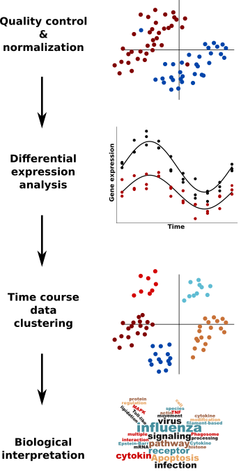

```{r echo=FALSE, results="hide", message=FALSE}
# Loading dependencies
library(devtools)
library(limma)
library(splines)
library(stats)
library(knitr)
library(kableExtra)
library(BiocStyle)
library(biomaRt)

library(ggplot2)
library(NMF)
library(KEGGprofile)
library(viridis)

library(topGO)

library(moanin)

source("utils.R")
```

```{r echo=FALSE, include=FALSE}
knitr::opts_chunk$set(
  cache=TRUE, autodep=TRUE, warning=FALSE, error=FALSE, message=FALSE,
  echo=TRUE,
  duplicate.label="allow"
)
```


# TODO list


- Add legends to the plots that don't have.
- Currently have two functions "plot_genes", "plot_centroids", that do exactly
  the same thing. Find a better name for both of them
- switch to camel case function names
- shorten function names
- Remove the namespace call
- Move the normalization to a supplementary data
- Make clear that it applies to RNASeq and how to call the different functions
  to RNASeq
- Check that clustering can deal with count data.


# Introduction

Gene expression studies provide simultaneous quantification of the level of
mRNA from all genes in a sample. High-throughput studies of gene expression
have a long history, starting with microarray technologies in the 1990s
through to single-cell technologies. While many expression studies are
designed to compare the gene expression in distinct groups, there is also a
long history of time-course expression studies, where the the gene expression
is compared across time by measuring mRNA levels from different samples across
time [^1]. Such time course studies can vary from measuring a few distinct time
points, to sampling ten to twenty time points. Many longer time series are
particularly interested in investigating development over time. More recently,
single-cell studies track single cells through their development, and a single
cell is measured at a particular moment in its developmental progression -- a
value that is not know but estimated from the data as its "pseudo-time."

[^1]: Because the collection of the mRNA is often destructive, samples at
different time points are generally from different biological samples;
longitudinal studies, for example tracking the same subject over time, are
certainly possible in certain settings, but not directly considered here. 

While there are many methods that have been proposed for discrete aspects of
time course data, the entire workflow for analysis of such data remains
difficult, particularly for long, developmental time series. Most methods
proposed for time course data are concerned with detecting genes that are
changing over time (differential expression analysis), examples being `edge`
[@storey:significance], functional component analysis based models [@wu:more],
time-course permutation tests [@park:statistical], and multiple testing
strategies to combine singe time point differential expression analysis
[@sun:multiple]. However, with long time course datasets, particularly in
developmental systems, a massive number of genes will show *some* change. For
example, in the mice lung tissues infected with influenza, over 50% of genes
are shown to be changing over time. The task in these settings is often not to
detect changes in genes, but to categorize into biologically interpretable
patterns the vast number of changes discovered. 

We present here a workflow for such an analysis that consists of 4 main
parts (Figure \ref{fig:workflow}):

- Quality control and normalization;
- Identification of genes that are differentially expressed;
- Clustering of genes into distinct temporal patterns;
- Biological interpretation of the clusters.

This workflow represents an integration of both novel implementations of
previously established methods and new methodologies for the settings of
developmental time series. It relies on several standard packages for
analysing gene expression data, some specific for time-course data, others
broadly used by the community. We provide the various steps of the workflow as
functions in a R package called `moanin`.

```{r schema, echo=FALSE, fig.width=3, fig.cap="Workflow for analyzing time-course datasets."}



```

**EAP: General comment. Your function names are incredibly long compared to
standard functions. Also, will want to get rid of `moanin::` in front of
functions. It's more precise, but an average user doesn't ever experience the
`::` command; usually just package creaters.**

# Analysis of the dynamical response of mouse lung tissue to influenza

This workflow is illustrated using data from a micro-array time-course
experiment, exposing mice to three different strains of influenza, and
collecting lung tissue during 14 time-points after infection (0, 3, 6, 9, 12,
18, 24, 30, 36, 48, 60 hours, then 3, 5, and 7 days later)
[@shoemaker:ultrasensitive]. The three strains of influenza used in the
study are (1) a low pathogenicity seasonal H1N1 influenza virus
(A/Kawasaki/UTK4/2009 [H1N1]), a mildly pathogenic virus from the 2009
pandemic season (A/California/04/2009 [H1N1]), and a highly pathogenic H5N1
avian influenza virus (A/Vietnam/1203/2004 [H5N1]. Mice were injected with
$10^5$ PFU of each virus. An adidtional 42 mice were injected with a lower dose
of the Vietnam avian influenza virus ($10^3$ PFU).

By combining gene expression time-course data with virus growth data, the
authors show that the inflammatory response of lung tissue is gated until a
threshold of the virus concentration is  exceeded in the lung. Once this
threshold is exceeded, a strong inflammatory and cytokin production occurs.
This results provides evidence that the pathology response is non-linearly
regulated by virus concentration.


## Quality control and normalization

The first steps of analysis of gene expression data is always to do
normalization and quality control checks of the data. In what follows, we show
an example of this for the influenza data using generic methods; these steps
are not in specific to time course, but could be done for any gene expression
analysis. 

First let's load the data. The package `moanin` contains the normalized
data and meta of [@shoemaker:ultrasensitive].

```{r}
# Now load in the metadata
data(shoemaker2015)
meta = shoemaker2015$meta
data = shoemaker2015$data
```

### Exploratory analysis and quality control


Typically, two quality control and exploratory analysis steps are also
performed before and after normalization: (1) low dimensionality embedding of
the samples; (2) correlation plots between each samples. In both cases, we
expect a strong biological signal, while replicate samples should be strongly
clustered or correlated with one another.


Before performing any additional exploratory analysis, let us only keep highly
variable genes: we keep for this step only the top 50% most variable genes.

```{r}
variance_cutoff = 0.5
variance_per_genes = apply(data, 1, mad)
min_variance = stats::quantile(variance_per_genes, c(variance_cutoff))
variance_filtered_data = data[variance_per_genes > min_variance,]
```

```{r echo=FALSE, fig.width=6, fig.height=3, fig.caption="Distribution of variance"}
graphics::hist(variance_per_genes, breaks=100, col="black", xlab="Variance",
	       ylab="# probes", main="")
graphics::abline(v=min_variance, col="#AB0000", lw=2)
```

Let us first perform the PCA analysis. Here, we perform a PCA of rank 3 of the
centered and scaled gene expression data. 

```{r pca, fig.width=6, fig.height=6}
# Reorder genes on condition, time, and replicate

pca_data = stats::prcomp(t(variance_filtered_data), rank=3, center=TRUE, scale=TRUE) 
percent_var = round(100 * attr(pca_data, "percentVar"))
```

We then plot the two first components, and color each sample by (1) its
condition; (2) its sampling time. We use different markers for each replicate. **EAP: Unclear what 'markers' refers to**
We also plot the second and third components in the second row.

```{r pca_plots, fig.width=6, fig.height=6}
graphics::par(mfrow=c(2, 2), mar=c(2.5, 2.5, 2.5, 2.5))
graphics::plot(
    pca_data$x[, "PC2"], pca_data$x[, "PC1"],
    col=ann_colors$Group[meta$Group],
    pch=ann_markers$Replicate[as.factor(meta$Replicate)],
    xlab="PC2", ylab="PC1")
graphics::plot(
    pca_data$x[, "PC2"], pca_data$x[, "PC1"],
    col=ann_colors$Timepoint[as.factor(meta$Timepoint)],
    pch=ann_markers$Replicate[as.factor(meta$Replicate)],
    xlab="PC2", ylab="PC1")

graphics::plot(
    pca_data$x[, "PC2"], pca_data$x[, "PC3"],
    col=ann_colors$Group[meta$Group],
    pch=ann_markers$Replicate[as.factor(meta$Replicate)],
    xlab="PC2", ylab="PC3")
graphics::plot(
    pca_data$x[, "PC2"], pca_data$x[, "PC3"],
    col=ann_colors$Timepoint[as.factor(meta$Timepoint)],
    pch=ann_markers$Replicate[as.factor(meta$Replicate)],
    xlab="PC2", ylab="PC3")

```

Then, we plot the pearson correlation across each samples. We order the
samples by their Group (treatment) and Timepoint (the time of sampling).
Additionally, in this example, we order each treatment by strength of the
pathogenicity of the treatment: Control, Kawasaki, California, low dose of
Vietnam, then high dose of Vietnam.


```{r  correlation_plot, fig.width=6, fig.height=6, fig.caption="Cross-correlation of the samples"}

# Reorder the conditions such that:
#	- Control is before any influenza treatment
#	- Each treatment is ordered from low to high pathogeny
meta$Group = factor(meta$Group, levels(meta$Group)[c(3, 2, 1, 5, 4)])

# Reorder genes on condition, time, and replicate
ord = order(
  meta$Group,
  meta$Timepoint,
  meta$Replicate)

variance_filtered_data = variance_filtered_data[, ord]
data_corr = stats::cor(variance_filtered_data, method="pearson")
data_corr_meta = meta[ord, ]
data_corr_meta$Timepoint = as.factor(data_corr_meta$Timepoint)

NMF::aheatmap(
    data_corr,
    Colv=NA, Rowv=NA,
    annCol=data_corr_meta[, c("Group", "Timepoint")],
    annRow=data_corr_meta[, c("Group", "Timepoint")],
    annLegend=TRUE, 
    annColors=ann_colors,
    main="Correlation plot")
```

We can already see interesting patterns emerging from the correlation plot.
First, the cross-correlation amongst samples taking from the control mice is
higher than the cross correlation amongst the rest of the treatments. Second,
the influenza-infected mice midly react until time point 36. Third, the less
pathogenic the strain is, the closer the samples are to the control condition.
Fourth, the Vietnam samples at time point 120 and 168 are the one that are the
most different from control samples.

## Differential expression analysis of time-course data

### Approaches to DE analysis in time-course data

The next step in a gene expression analysis is typically to run a differential
expression analysis, generally to find genes different between different
conditions. For time-course data, there are two different approaches for
determining differentially expressed genes,

1) Per-time point analysis, where we consider each time point a different
condition and determine what genes are changing between time points, or
between conditions at a single time-point. 

2) Global analysis, where we consider the expression pattern globally over
time, and consider what genes have either different patterns between
conditions or a changing pattern (i.e. non-constant) over time. A common
approach first step is to fit a spline model to each gene
[@storey:significance],
and then use that spline model to test for different kinds of differential
expression across time. 


The per-time point analysis is using classical differential expression
approaches, and is often the approach advocated when dealing with small
time-course datasets, where there are only a few time points 
[@ritchie:limma, @robinson:edgeR, @love:moderated] . For long time-course datasets,
however, a separate test for each time-point results in creating many
different tests, for example one for every time point, the results of which
are difficult to integrate. We find in practice that the global analysis
simplifies analysis and of longer time courses data, with per-time point
analysis reserved for particularly interesting comparisons of individual
time-points. 

We note that we could have time course data on either a single condition or
time course data on multiple conditions (such as the influenza dataset we are
considering), which will alter slightly the types of questions we are
interested in, but the two basic approaches remains the same. In what follows,
we will focus on the situation where we have multiple conditions. **EAP: Any
reason one and not the other. Maybe should change this sentence**


**Use with `moanin`** `moanin` provides functionality for performing both of
these types of approaches, though our focus is on the global approach. In both
situations, we first need to set up a object (a `splines_model` object) to
hold the meta data, as well as information for fitting the spline model. 

We start by creating the `splines_model` object using the
`create_splines_model` function. The `splines_model` object contains a number
of metadata and options used throughout this analysis: the condition and
timepoints of each samples, the formula object used or the basis or the
degrees of freedom of the model. The metadata data.frame object should
contain at least two columns: one named `Group`, containing the  treatement
effect, and a second one named `Timepoint` containing the timepoint
information.

```{r echo=FALSE}
kable(head(meta))
```

If no formula is provided, it will default to the following: 
`formula = ~Group:splines::ns(Timepoint, df=degrees_of_fredoom) + Group + 0` 

```{r}
splines_model = moanin::create_splines_model(meta, degrees_of_freedom=6)
```

Here we have provided the meta data that defines... `create_splines_model`
will .... **FIXME add information about what meta data is expected, describe
what `create_splines_model` does (does it fit the splines? Just hold create an
object? Create basis functions?)**. 


**EAP: General comment: you need a few more print() and head() of some objects to demonstrate what the output looks like**

### Weekly differential expression analysis

`moanin` provides a simple interface to perform a timepoint by timepoint
differential expression analysis. This is traditionally done by the user
defining the comparisons (called `contrasts` in linear models).  Under the
hood, simply calls `limma` [@ritchie:limma] on the set of contrasts provided.
By default, it expects RNA-Seq contact counts, and will estimate voom weights.
We tern

Here, we show an example where we define our contrasts to be the difference
between the control mouse ("M") and the mouse infected with the high dose of
the influenza strain A/Vietnam/1203/04 (H5N1) ("VL") for each time point, but
the function works with any form contrasts [@ritchie:limma].

First, create the contrasts for all timepoints between the two groups of
interest:
```{r make_timepoints_contarts}
contrasts = create_timepoints_contrasts("M", "VL", splines_model)
```

```{r echo=FALSE}
kable(contrasts)
```

Then run the differential expression analysis on all of those timepoints
jointly.

```{r weekly_differential_analysis}
# Define contrast	
weekly_de_analysis =  moanin::DE_timepoints(
     data, splines_model, contrasts,
     use_voom_weights=FALSE)
```

```{r echo=FALSE}
kable(weekly_de_analysis[1:10, ])
```

We can repeat this for each of the conditions

```{r echo=FALSE, results="hide"}
contrasts = create_timepoints_contrasts("M", "K", splines_model)
K_weekly_de_analysis =  moanin::DE_timepoints(
     data, splines_model, contrasts,
     use_voom_weights=FALSE)

contrasts = create_timepoints_contrasts("M", "C", splines_model)
C_weekly_de_analysis =  moanin::DE_timepoints(
     data, splines_model, contrasts,
     use_voom_weights=FALSE)

contrasts = create_timepoints_contrasts("M", "VH", splines_model)
VH_weekly_de_analysis =  moanin::DE_timepoints(
     data, splines_model, contrasts,
     use_voom_weights=FALSE)
	 
```


Let's look at the distribution of genes found differentially expressed per
week between control and each of the influenza strains.

```{r fig.width=6, fig.height=6, echo=FALSE}
par(mfrow=c(2, 2))

time = c(0, 3, 6, 9, 12, 18, 24, 30, 36, 48, 60, 72, 120, 168)

timely_barplot = function(de_analysis, labels, qval_threshold=0.05, title=""){
    qval_colnames = colnames(de_analysis)[
	grepl("qval", colnames(de_analysis))]
    number_de_genes_per_time = colSums(de_analysis[, qval_colnames] < 0.05)
    names(number_de_genes_per_time) = labels[1]
    barplot(number_de_genes_per_time, col="black", ylim=c(0, 20000),
	    xlab="Timepoint", ylab="Number of DE genes", main=title)
    
}

timely_barplot(K_weekly_de_analysis, time, title="Kawasaki")
timely_barplot(C_weekly_de_analysis, time, title="California")
timely_barplot(weekly_de_analysis, time, title="Vietnam low-dose")
timely_barplot(VH_weekly_de_analysis, time, title="Vietnam high-dose")
```

The distribution of number of genes found differentially expressed by
considering each time-point independantly highlights the challenges of such
approach. Timepoint 6H and 18H of the Kawasaki strain have fewer numbers of
genes found differentially expressed than timepoints 3H and 9H: this is likely
due to biological or technical variances for specific genes at specific
timepoints. **EAP: We should add more to this**

As a summary, classic differential expression methods are appropriate for
unordered treatments, but fail to use the temporal structure of the data.


### Time-course differential expression analysis between two groups

To leverage this temporal structure, Storey et al [@storey:significance]
proposed to model each gene in time-course micro-array with a splines
function, and to use a log-ratio likelihood test to detect differentially
expressed genes. 

`moanin` extends this idea by providing functionality to compare time course
data between different treatment conditions, using a similar mechanism of
contrasts -- only now the contrasts are differences between the estimated
means.

**FIXME add in equations, like from the EPICON paper, to describe them mathematically**

**EAP: Do we need this call to limma by the user, or can these not be done
internally by the `timecourse_differential_expression_analysis` function? We
can still preserve the option of user defining their own, but would be nicer
to make this simpler for the user (e.g. an if clause that tests whether input
is matrix or character vector)**

```{r de_analysis}
# Differential expression analysis
timecourse_contrasts = c("M-K", "M-C", "M-VL", "M-VH")

contrasts = limma::makeContrasts(
	contrasts=timecourse_contrasts,
	levels=levels(meta$Group))

# The function takes the data (data.frame or named matrix), the meta data
# (data.frame containing a timepoint and group column, the first corresponding
# to the time-course information, the latter corresponding to the
# treatment).
pvalues = moanin::DE_timecourse(
    data, splines_model, contrasts,
    use_voom_weights=FALSE)
qvalues = apply(pvalues, 2, stats::p.adjust)

```

The number of genes found differentially expressed ranges from around 12000 to
29000 depending on the strain and dosage of influenza virus given to the mice.
This corresponds to between 30% to 70% of the genes found differentially
expressed in this time-course experiment.

```{r echo=FALSE, fig.width=3, fig.height=3, fig.caption="Distribution of DE genes per condition"}
num_de = colSums(qvalues < 0.05)
names(num_de) = c(
    "Kawasaki", "California", "Vietnam LD", "Vietname HD")
barplot(num_de, col="black", ylab="Number of DE genes")
```

The next step in a classical differential expression analysis is typically to
assess the effect of the treatment by looking at the log fold change.
Computing the log fold change on a time-course experiment is not trivial: one
can be interested in the average log-fold change across time, or the
cumulative log-fold change. Sometimes a gene can be over-expressed at the
beginning of the time-course data, and then over-expressed at the end of the
experiment. As a result, `moanin` provides a number of possible ways to
compute the log fold change across the whole time-course.

First, `moanin` provides as simple interface to compute the log-fold change
for each individual timepoints.

```{r}
log_fold_change_timepoints = moanin::estimate_log_fold_change(
    data, splines_model, contrasts,  method="timely")
```

```{r echo=FALSE}
kable(
    head(log_fold_change_timepoints[, colnames(log_fold_change_timepoints)[1:5]]),
    format = "latex")
```

This matrix can then be used to visualize the log-fold change for each
contrast per timepoint.

Sometimes, a single value per gene and per contrast is more useful. Here is a
table of the possible ways to compute log-fold change values.

| Name   | Formula   |     |
|------- | --------- |--- |
| timely | $\text{lfc}(t)$  | Function of time |
| sum  | $\sum_t lfc(t)$  | Sum of log fold change. |
| abs_sum  | $\sum_t \|lfc(t)\|$  | Always positive |
| max  | $\max_t \|lfc(t)\|$  | Always positive  |
| min  | $\min_t \|lfc(t)\|$  | Always positive |
| epicon  | $$  | Captures overall strength of response and overall direction |

**EAP: `epicon` is going to be weird for general use**

```{r}
log_fold_change_epicon = moanin::estimate_log_fold_change(
    data, splines_model, contrasts,  method="epicon")

log_fold_change_sum = moanin::estimate_log_fold_change(
    data, splines_model, contrasts,  method="sum")

log_fold_change_max = moanin::estimate_log_fold_change(
    data, splines_model, contrasts, method="max")

log_fold_change_min = moanin::estimate_log_fold_change(
    data, splines_model, contrasts, method="min")
```


```{r echo=FALSE, fig.height=6, fig.width=6, message=FALSE}
par(mfrow=c(2, 2))
plot(log_fold_change_epicon[, "M-C"],
     log_fold_change_sum[, "M-C"], pch=20, main="EPICON vs sum",
     xlab="EPICON", ylab="sum")
plot(log_fold_change_epicon[, "M-C"],
     log_fold_change_max[, "M-C"], pch=20, main="EPICON vs max",
     xlab="EPICON", ylab="max")
plot(log_fold_change_max[, "M-C"],
     log_fold_change_min[, "M-C"], pch=20, main="max vs min",
     xlab="max", ylab="min")
plot(log_fold_change_max[, "M-C"],
     log_fold_change_sum[, "M-C"], pch=20, main="max vs sum",
     xlab="max", ylab="sum")
```

From the single measures of log-fold change and the p-value, we can now look
at the volcano plot. Here is an example of a volcano plot for the comparaison
of the control to the Kawasaki strain, using the EPICON log fold change
computation.

```{r fig.height=4, fig.width=4}
pvalue = qvalues[, "M-K"]
lfc_epicon = log_fold_change_epicon[, "M-K"]
names(lfc_epicon) = row.names(log_fold_change_epicon)

plot(lfc_epicon, -log10(pvalue), pch=20, main="Volcano plot",
     xlim=c(-2.5, 2))
```

As another sanity check, `moanin` provides a simple utility function to
visualize gene time-course data. Here, we plot the 12 genes with the smallest
p-values.

```{r fig.height=6, fig.width=6}
top_DE_genes_pval = names(sort(pvalue)[1:12])
moanin::plot_genes(data[top_DE_genes_pval, ], splines_model,
		   colors=ann_colors$Group, smooth=TRUE)
```

And here we visualize the genes with the largest absolute EPICON log-fold
change.

```{r fig.height=6, fig.width=6}
top_DE_genes_lfc = names(
    sort(abs(lfc_epicon),
	 decreasing=TRUE)[1:12])
moanin::plot_genes(data[top_DE_genes_lfc, ], splines_model,
		   colors=ann_colors$Group, smooth=TRUE)

```

Thanks to those visualization, we can see that genes often follow similar
patterns of expression, although on a different scale for each gene. We can
leverage this observation to cluster the genes into groups of similar patterns
of transcriptomic response.


## Clustering of time-course data


The very large number of genes found differentially expressed impair any
interpretation one would attempt: with 70\% of the genome found differentially
expressed, all pathways are affected by the treatment. Hence the next step of
the workflow to cluster gene expression according to their dynamical response
to the treatment. Before clustering the genes, we first reduce the set of
genes of interest to genes that are (1) significantly found differentially
expressed; (2) "highly" differentially expressed. To do this, we first
aggregate all p-values obtained during the time-course differential expresison
step in a single p-value using Fisher's method [@fisher:statistical]. Then we
select all the genes which have a Fisher adjusted p-value below 0.05 and a log
fold change of at least two between at least one condition and one time-point.
Reducing the set of genes on which to perform the clustering allows to
estimate the centroids with more stability.


```{r filter_genes}
# Then rank by fisher's p-value and take max the number of genes of interest
# Filter out q-values for the pvalues table
fishers_pval = moanin::pvalues_fisher_method(pvalues)
fishers_qval = stats::p.adjust(fishers_pval)

genes_to_keep = row.names(
    log_fold_change_max[
	(rowSums(log_fold_change_max > 2) > 0) &
	(fishers_qval < 0.05), ])
# Keep the data corresponding to the genes of interest in another variable.
y = as.matrix(data[genes_to_keep, ])
```

After filtering, we are left with `r dim(y)[1]` genes. We can then apply a
clustering. As observed by looking at genes found differentially expressed, 
many genes share a similar gene expression pattern, but on different scale.
We thus propose the following adaptation of k-means:

- **Splines estimation**: for each gene, fit the splines function with the basis
  of your choice.
- **Rescaling splines**: for each gene, rescale the estimated splines function
  such that the values are bounded between 0 and 1.
- **K-means**: apply k-means on the rescaled fitted splines to estimate the
  centroids.
- **Assign scores and labels to all genes**: then assign a score and a label
  to all gene based on a goodness-of-fit measure on the raw data. By default,
  the `splines_kmeans_score_and_label` function only labels the best 50% of
  genes.


The first three steps are performed jointly by the `splines_kmeans` function.

```{r clustering}
# First fit the kmeans clusters
kmeans_clusters = moanin::splines_kmeans(
    y, splines_model, n_clusters=8,
    random_seed=42,
    n_init=20)
```

We then use the `plot_centroids` function to visualize the centroids obtained
with the splines k-means model. 

```{r fig.height=6, fig.width=6}
moanin::plot_centroids(kmeans_clusters$centroids, splines_model,
		       colors=ann_colors$Group,
		       smooth=TRUE)
```

The scoring and labeling can be done via the `splines_kmeans_score_and_label`
function.

```{r}
# Then assign scores and labels to all the data, using a goodness-of-fit
# scoring function.
scores_and_labels = moanin::splines_kmeans_score_and_label(
    data, kmeans_clusters)
labels = scores_and_labels$labels

# Let's keep only the list of genes that have a label.
labels = unlist(labels[!is.na(labels)])
```

Before performing the next steps, let us investigate in more detail the
differences between the labels provided by the splines k-means model and the
scoring and labelinig step.

```{r echo=FALSE, fig.height=6, fig.width=6, warning=FALSE}
par(mfrow=c(2, 1))
barplot(table(kmeans_clusters$clusters),
	col="black",
	main="splines k-means labeling")
barplot(table(labels), col="black", main="score and label")
```

The scoring and label step allows to label genes that were removed during the
filtering step, yet are good matches to the centroids found during the
clustering.

```{r echo=FALSE, fig.height=6, fig.width=6, fig.caption="Confusion matrix between the two sets of labels"}
genes_scored = names(labels)

kmeans_labels = kmeans_clusters$clusters
kmeans_labels = kmeans_labels[genes_scored]

labels = labels[names(kmeans_labels)]

both_labels = data.frame("kmeans"=kmeans_labels, "scored"=labels)
# Create another cluster.
#both_labels[is.na(both_labels)] = 21
confusion_matrix = table(both_labels)
text = as.matrix(as.character(confusion_matrix))
dim(text) = dim(confusion_matrix)
NMF::aheatmap(confusion_matrix, treeheight=0, main="Confusion matrix", 
	      border_color="black", txt=text, legend=FALSE, Rowv=NA,
	      Colv=NA)
labels = scores_and_labels$labels
labels = unlist(labels[!is.na(labels)])

```


```{r results="hide", echo=FALSE}
# Save the clustering for the GO term and pathway enrichment on the whole set
# of clusters.
kmeans_labels = as.data.frame(labels[!is.na(labels)])
write.table(kmeans_labels,
	    ".results/clustering_labels.txt",
	    sep="\t")
```


### Looking at specific clusters in details.

Now, let us look more in detail some specific clusters. Cluster 8 seems
particularly interesting: it captures genes with strong differences between
the differant influenza treatments and the control, while the control remains
relatively flat.

Heatmaps are useful to investigate the range of expression patterns for
specific genes. Here, we are going to plot heatmaps of the normalized gene
expression patterns and the rescaled gene expression patterns side by side.

First, select the genes of interest.

```{r}
cluster_to_plot = 8
genes_to_plot =  names(labels[labels == cluster_to_plot])
```


```{r fig.width=6, fig.height=8}
layout(matrix(c(1,2),nrow=1), widths=c(1.5, 2))

data_to_plot = data[genes_to_plot, ]
submeta = meta
ord = order(
  submeta$Group,
  submeta$Timepoint,
  submeta$Replicate)
submeta$Timepoint = as.factor(submeta$Timepoint)

data_to_plot = data_to_plot[, ord]
submeta = submeta[ord, ]

res = NMF::aheatmap(
    data_to_plot,
    Colv=NA,
    color="YlGnBu",
    annCol=submeta[,
                c("Group", "Timepoint")],
    annLegend=FALSE,
    annColors=ann_colors,
    main=paste("Cluster", cluster_to_plot, "(raw)"),
    treeheight=0, legend=FALSE)

# Now use the results of the previous call to aheatmap to reorder the genes.
NMF::aheatmap(
    moanin:::rescale_values(data_to_plot)[res$rowInd,],
    Colv=NA,
    Rowv=NA,
    annCol=submeta[,
                c("Group", "Timepoint")],
    annLegend=TRUE,
    annColors=ann_colors,
    main=paste("Cluster", cluster_to_plot, "(rescaled)"),
    treeheight=0)

```

Those two heatmaps demonstrate that the clustering method successfully cluster
genes that are on different scales, and yet share the same dynamical response
to the treatments.

### How to choose the number of clusters.

A common question that arises when performing clustering is how to choose the
number of clusters. A choice for the number of clusters K depends on the goal. 
In this particular case, the end goal is not the clustering, but to facilitate
interpretation of the differential expression analysis step. As a result, the
number of clusters should not exceed the number of gene sets the user wants to
interpret. This allows to set a maximum number of clusters. Let us assume here
that this number is 20 clusters.

Once the maximum number of clusters is set, several strategies allow to
identify the number of clusters:

- **Elbow method**. First introduced in 1953 by Thorndike [@thorndike:who],
  the elbow methods looks at the total with cluster sum of squares 
  as a function of the number of clusters (WCSS). When adding clusters
  doesn't decrease the WCSS by a sufficient
  amount, one can consider stopping. This method thus provides visual aid to
  the user to choose the number of clusters, but often the "elbow" is hard to
  see on real data, where the number of clusters is not clearly defined.
- **Silhouette method**. Similarly to the Elbow method, the Silhouette method
  refers to a method of validation of consistency within clusters, and
  provides visual aid to choose the number of clusters.
- **Stability methods** Stability methods are more computationally intensive
  than any other method, as they rely on assessing the stability of the
  clustering for every $k$ to a small randomization of the data. The user is
  then invited to choose the number of cluster based on a number of similarity
  measures.

First, let us run the clustering for all possible clusters of interest. We
will, for each clustering experiment, conserve (1) with within cluster sum of
squares; (2) the labels assigned to all genes.

```{r running_clustering_on_all_k}
all_possible_n_clusters = c(5, 9, 11, 15)
all_clustering = list()
wss_values = list()

i = 1
for(n_cluster in all_possible_n_clusters){
    clustering_results = moanin::splines_kmeans(
	y, splines_model,
	n_clusters=n_cluster, random_seed=42,
	n_init=10)
    wss_values[i] = sum(clustering_results$WCSS_per_cluster)
    all_clustering[[i]] = clustering_results$clusters
    i = i + 1
}
```

#### Elbow method

The Elbow method to choose the number of clusters relies on visualization aid
to choose the number of cluster. The method relies on plotting the within
cluster sum of squares as a function of the number of clusters. At some point,
the WCSS will stop dropping, giving an angle in the graph.  The number of
cluster is chosen at this "Elbow point."


```{r elbow_method, fig.width=6, fig.height=4}
plot(all_possible_n_clusters, wss_values,
     type="b", pch=19, frame=FALSE, 
     xlab="Number of clusters K",
     ylab="Total within-clusters sum of squares")

```

#### Average silhouette method

The silhouette value is a measure of how similar a data point is to its own
cluster (cohesion) compared to other clusters (separation). 

```{r average_silhouette_method, fig.width=6, fig.height=4}
# function to compute average silhouette for k clusters
average_silhouette = function(labels, y) {
    silhouette_results = cluster::silhouette(unlist(labels[1]), dist(y))
    return(mean(silhouette_results[, 3]))
}

# extract the average silhouette
average_silhouette_values = list()
i = 1
for(i in 1:length(all_clustering)){
    clustering_results = all_clustering[i]
    average_silhouette_values[i] = average_silhouette(clustering_results, y)
    i = i + 1
}

plot(all_possible_n_clusters, average_silhouette_values,
     type="b", pch=19, frame=FALSE,
     xlab="Number of clusters K",
     ylab="Average Silhouettes")
```

#### Looking at the stability of the clustering

On real data, the number of clusters is not only unknown but also 
ambiguous: it will depend on the desired clustering resolution of the user.
Yet, in the case of biological data, stability and reproducibility of the
results is necessary to ensure that the biological interpretation of the
results hold when the data or the model is exposed to reasonable
perturbations.

Methods that rely on the stability of the clustering results to choose $k$
thus ensure that the biological interpretation of the clusters hold with
perturbtation to the data. In addition, simulation where the data is generated
with a well defined $k$ show that the clustering is more stable for the
correct of number of the clusters.

Most methods method to find the number of clusters with stability measures
only provide visual aids to guide the user. The first element often visualized
is the consensus matrix: the consensus matrix is an $n \times n$ matrix that
stores the proportion of clustering in which two items are clustered together.
A perfect consensus matrix ordered such as each elements that belong to the
same cluster are adjacent to one another which show blocks along the diagonal
close to 1.

To perform such analysis, the first step is run the clustering several times
on a resampled dataset--either using bootstrap or subsampling.

Using the bootstrapping strategy:
```{r}
n_genes = dim(y)[1]
indices = sample(1:dim(y)[1], n_genes, replace=TRUE)

bootstrapped_y = y[indices, ]
```

Using the subsampling strategy, keeping 80% of the genes:

```{r}
subsample_proportion = 1
indices = sample(1:dim(y)[1], n_genes * subsample_proportion, replace=FALSE)
subsampled_y = y[indices, ]
```

Here we plot to stability matrix of the top 1000 genes for $k=5$ and $k=20$.

```{r fig.width=6, fig.height=4}
stability_5 = read.table("results/stability_5.tsv", sep="\t")
consensus_matrix_stability_5 = moanin::consensus_matrix(stability_5,
							scale=FALSE)
NMF::aheatmap(consensus_matrix_stability_5[1:1000, 1:1000], Rowv=FALSE,
	      Colv=FALSE,
	      treeheight=0)

stability_20 = read.table("results/stability_20.tsv", sep="\t")
consensus_matrix_stability_20 = moanin::consensus_matrix(stability_20,
							 scale=FALSE)
NMF::aheatmap(consensus_matrix_stability_20[1:1000, 1:1000], Rowv=FALSE,
	      Colv=FALSE,
	      treeheight=0)

```


```{r echo=FALSE, results="hide"}
n_clusters = 2:20
all_labels = list()
for(i in n_clusters){
    filename = paste0("results/stability_", i, ".tsv")
    stability = read.table(filename, sep="\t")
    all_labels[[paste0("C", i)]] = stability
}
```


##### The model explorer strategy

The model explorer algorithm [@ben-hur:stability] proposes to estimate the
number of clusters exploiting the observation that if the number of clusters
is correct, the clustering results are stable to bootstrapping.  The
distribution of similaries between bootstrapped results for each $k$ can thus
be compared for different values of $k$ and guide the user in the choice of
number of clusters.

The model explorer strategy works as follows. First, choose a similarity
measure between two partitions or clusters $S(C_1, C_2)$. Examples are the
normalized mutual information or Fowlkes-Mallows. Then perform $n$ bootstrap
experiments to estimate the cluster centroids, followed by a step of assigning
a label to all data points. Finally, compute the pairwise similarity measure
between all bootstrapped partition, and plot the cumulative density of the
obtained scores.

```{r fig.width=6, fig.height=6}
moanin::plot_model_explorer(all_labels)
```

From this plot, we can deduce that $k=5$ is more stable than $k=3$ and $k=4$,
but not as stable as $k=2$. The model explorer strategy, in addition to
visualizing the diversity of the centroids, can thus help assessing an
adequate number of clusters.

Now, replot the same model explorer, but only for the clustering experiments
$k=6$, $k=7$, $k=8$, $k=9$ and $k=10$ so that we can see more clearly the stability
measures in that range.


```{r fig.width=6, fig.height=6}
clusters = c("C6", "C7", "C8", "C9", "C10")
selected_labels = all_labels[clusters]
moanin::plot_model_explorer(selected_labels)
```

##### Consensus clustering as a way to find $k$


The  consensus clustering [@monti:consensus] relies on a similar idea but
instead of looking at the cumulative density of similarity measures of
bootstrapped clustering, the authors suggests plotting the cumulative density
of elements of the consensus matrix. 

```{r eval=FALSE}
moanin::plot_cdf_consensus(all_labels)
```

```{r echo=FALSE}
knitr::include_graphics("images/clustering_CDF_consensus.png")
```

The stability of the clustering based on the consensus matrix can then be
measured via a single number by looking at the area under the curve: the more
stable the clustering, the closer to 0 or 1 will be the entries of consensus
matrix. The consensus clustering strategy thus suggest at looking at either
the AUC as a function of the number of the clusters or the "improvement" in
the AUC as a function of the number of cluster.

```{r echo=FALSE}
knitr::include_graphics("images/clustering_AUC_consensus.png")
```

```{r echo=FALSE}
knitr::include_graphics("images/clustering_delta_AUC_consensus.png")
```

The consensus clustering method suggest that the most stable is $k=2$, which
separates over-expressed genes from under-expressed genes. While it is indeed
a very stable clustering, it does not capture the range of gene expression
patterns present in the data. This shows the limitation of such method on real
data, where the number of clusters is not clearly defined.


## Downstream analysis of clusters.

Once good clusters are obtained, the next step is to leverage the clustering
to ease interpretation. Classic enrichment analysis step can then be performed
in the gene set defined in each cluster: KEGG pathway enrichment analysis, GO
term enrichment analysis, motif enrichment analysis, etc.

First, let us clean up the gene obtained and only select the genes we are
going to use in the enrichment analysis. One can either use the whole set of
genes, only the set of differentially expressed genes in each cluster, or a
subset of genes that fit well to a cluster (based on some criterion).

### Finding enriched pathways using `biomaRt` and `KEGGprofile`

Let us first tackle the case of pathway enrichment analysis. We will leverage
the packages `biomaRt` [@durinck:biomart] and `KEGGprofile` [@zhao:keggprofile]
for this step. `KEGGprofile` is a
package that easily allows to perform pathway enrichment analysis on a set of
genes labeled with the ensembl annotation. We thus need to convert the gene
names into the appropriate format. This is where `biomaRt` comes in handy: it
enables easy conversion from one gene annotation to another. Here, we will use
it to convert the gene names from the Refseq annotation to the ensembl one.


```{r results="hide"}
ensembl = biomaRt::useMart("ensembl")
ensembl = biomaRt::useDataset("mmusculus_gene_ensembl", mart=ensembl)
```

```{r enrichment_analysis, results="hide", message=FALSE}
cluster = 8
labels = unlist(labels)
gene_names = names(labels)
genes = gene_names[labels == cluster]

# convert gene names
genes = biomaRt::getBM(attributes=c("ensembl_gene_id", "entrezgene"),
		filters="refseq_mrna", values=genes,
		mart=ensembl)["entrezgene"]
genes = as.vector(unlist(genes))
pathways = KEGGprofile::find_enriched_pathway(
    genes, species="mmu",
    download_latest=TRUE)$stastic

```

```{r echo=FALSE}

pathways = pathways[
    order(pathways["pvalueAdj"]),]

# Select the columns to print
pathways = subset(
    pathways,
    select=c(
	"Pathway_Name", "Percentage",
	"pvalueAdj"))

colnames(pathways) = c("Pathway", "Percentage", "Adj. p-value")
pathways["Percentage"] = pathways["Percentage"] * 100
kable(pathways[1:10, ], "latex", escape=F, digits=4) %>%
    kable_styling("striped", full_width=TRUE) 
```


### Finding enriched GO terms

To find GO terms, we use `biomaRt` to find the mapping between GO terms and
gene mapping. The GO enrichment library `topGO` [@alexa:topgo] expects the GO term to gene
mapping to be a list where each item is a mapping between a gene name and a GO
term ID vector. 

```text
$NM_199153
[1] "GO:0016020" "GO:0016021" "GO:0007186" "GO:0004930" "GO:0007165"
[6] "GO:0050896" "GO:0050909"

$NM_201361
 [1] "GO:0016020" "GO:0016021" "GO:0003674" "GO:0008150" "GO:0005794"
 [6] "GO:0005829" "GO:0005737" "GO:0005856" "GO:0005874" "GO:0005739"
[11] "GO:0005819" "GO:0000922" "GO:0072686"
```

`biomaRt` queries results a matrix with two named columns of gene names and GO
term ID.


```{r go_to_gene_mapping, results="hide", message=FALSE}
genes = biomaRt::getBM(attributes=c("go_id", "refseq_mrna"),
	      values=gene_names,
	      filters="refseq_mrna",
	      mart=ensembl)

# Create gene to GO id mapping
gene_id_go_mapping = moanin::create_go_term_mapping(genes)
```

Once the gene ID to GO mapping list is created, `moanin` provides a simple
interface to `topGO` to fetch enriched GO terms. Here, we show an example of
running a GO term enrichment on the "Biological process" ontology (BP).

```{r go_term_enrichment, results="hide", message=FALSE}
assignments = labels == cluster

go_terms_enriched = find_enriched_go_terms(
    assignments,
    gene_id_go_mapping, ontology="BP")
```

```{r echo=FALSE}

go_terms_enriched = go_terms_enriched[
    order(go_terms_enriched[, "resultFisher_padj"]), ]
colnames(go_terms_enriched) = c("GO ID", "Description", "Annotated",
"Significant", "Expected", "P-value", "adj. p-value")

kable(go_terms_enriched[1:15, ], "latex", escape=F, digits=4)  %>%
    kable_styling("striped", full_width=TRUE) 
```


# Session information

```{r}
sessionInfo()
```

# Conclusion

This workflow provides a tutoral for the analysis of time-course gene
expression data in R, illustrated through the analysis of mice lung tissue
exposed to different influenza strain. It covers four main steps; (1) quality
control and normalization; (2) differential expression analysis; (3)
clustering of time-course gene expression data; (4) downstream analysis of
clusters.

# Software and data availability

The source code for this workflow can be found at [https://github.com/NelleV/2019timecourse-rnaseq-pipeline](https://github.com/NelleV/2019timecourse-rnaseq-pipeline).
Data used in this workflow are available from NCBI GEO, accession GSE95601.

# Author contributions

NV and EP wrote the workflow.

# Competing interests
The authors declare that they have no competing interests.

# Grant information

This research was funded in part by a Department of Energy (DOE) grant
(DE-SC0014081); by the Gordon and Betty Moore Foundation (Grant GBMF3834) and
the Alfred P. Sloan Foundation (Grant 2013-10-27) to the University of
California, Berkeley [N.V.]; by a ENS-CFM Data Science Chair [E.P.].

*I confirm that the funders had no role in study design, data collection and
analysis, decision to publish, or preparation of the manuscript.*

# Acknowledgments

The authors thank Karthik Ram and the Ropensci community for valuable
feedback.

# References

